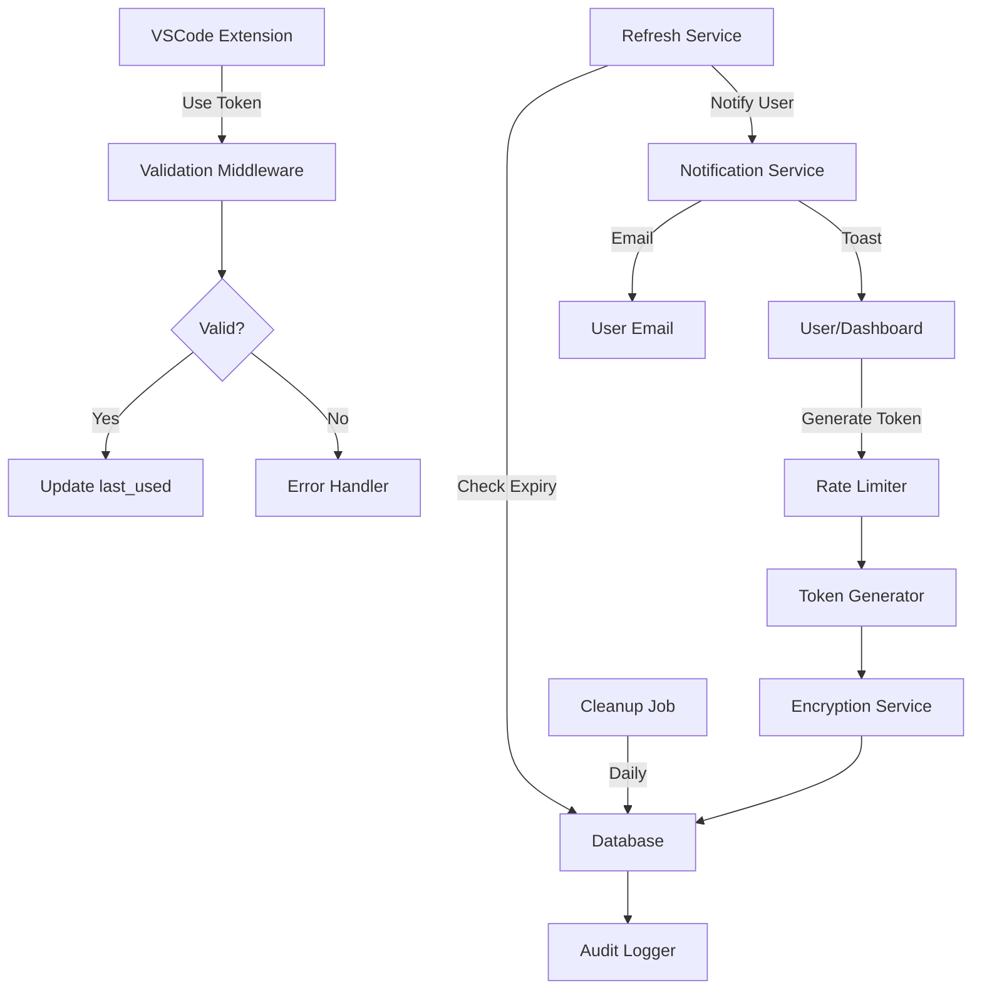

# Comprehensive Authentication Token System Enhancement Plan

## Executive Summary

This document outlines the enhancement plan for the authentication token generation system in the `/dashboard` route. The implementation will add missing features to the existing 4-month long-lived token system, focusing on security, usability, and compliance.

## Current System Analysis

### ✅ Already Implemented
- 4-month long-lived JWT token generation (`/api/extension-token/generate`)
- Token storage with bcrypt hashing in `extension_tokens` table
- Token revocation endpoint (`/api/extension-token/revoke`)
- Active token checking endpoint (`/api/extension-token/active`)
- Basic dashboard UI for token generation
- Clerk authentication integration
- Database RLS policies and cleanup functions

### ❌ Missing Features (To Be Implemented)
1. Token validation middleware with expiration checks
2. Token refresh endpoint for near-expiration scenarios
3. Strict rate limiting on token generation
4. Enhanced error handling with user-friendly messages
5. Encryption for sensitive token metadata
6. Comprehensive audit logging
7. Enhanced dashboard UI with token details
8. Token usage tracking
9. Notification system for token lifecycle events
10. Enhanced CORS configuration
11. Multiple named tokens support
12. Security headers
13. Automated cleanup jobs
14. Token rotation policy
15. Integration tests
16. Complete documentation

---

## Architecture Design

### System Components



### Database Schema Enhancements

#### Enhanced `extension_tokens` Table
```sql
ALTER TABLE extension_tokens ADD COLUMN IF NOT EXISTS device_name TEXT;
ALTER TABLE extension_tokens ADD COLUMN IF NOT EXISTS device_info_encrypted TEXT;
ALTER TABLE extension_tokens ADD COLUMN IF NOT EXISTS ip_address_encrypted TEXT;
ALTER TABLE extension_tokens ADD COLUMN IF NOT EXISTS refresh_count INTEGER DEFAULT 0;
ALTER TABLE extension_tokens ADD COLUMN IF NOT EXISTS warning_sent_at TIMESTAMP WITH TIME ZONE;
```

#### New `token_audit_logs` Table
```sql
CREATE TABLE token_audit_logs (
  id UUID PRIMARY KEY DEFAULT uuid_generate_v4(),
  token_id UUID REFERENCES extension_tokens(id) ON DELETE CASCADE,
  user_id UUID REFERENCES users(id) ON DELETE CASCADE,
  action TEXT NOT NULL, -- 'generated', 'used', 'refreshed', 'revoked', 'expired'
  details JSONB,
  ip_address TEXT,
  user_agent TEXT,
  created_at TIMESTAMP WITH TIME ZONE DEFAULT NOW()
);

CREATE INDEX idx_token_audit_logs_token_id ON token_audit_logs(token_id);
CREATE INDEX idx_token_audit_logs_user_id ON token_audit_logs(user_id);
CREATE INDEX idx_token_audit_logs_action ON token_audit_logs(action);
CREATE INDEX idx_token_audit_logs_created_at ON token_audit_logs(created_at);
```

#### New `token_rate_limits` Table
```sql
CREATE TABLE token_rate_limits (
  id UUID PRIMARY KEY DEFAULT uuid_generate_v4(),
  user_id UUID REFERENCES users(id) ON DELETE CASCADE,
  action TEXT NOT NULL, -- 'generate', 'refresh'
  window_start TIMESTAMP WITH TIME ZONE NOT NULL,
  request_count INTEGER DEFAULT 1,
  created_at TIMESTAMP WITH TIME ZONE DEFAULT NOW(),
  updated_at TIMESTAMP WITH TIME ZONE DEFAULT NOW()
);

CREATE INDEX idx_token_rate_limits_user_action ON token_rate_limits(user_id, action, window_start);
```

---

## Implementation Details

### 1. Token Validation Middleware Enhancement

**File**: `api/middleware/token-validation.js`

```javascript
const jwt = require('jsonwebtoken');
const bcrypt = require('bcrypt');
const { createClient } = require('@supabase/supabase-js');

const supabase = createClient(
  process.env.SUPABASE_URL,
  process.env.SUPABASE_SERVICE_ROLE_KEY
);

async function validateLongLivedToken(req, res, next) {
  try {
    const authHeader = req.headers.authorization;
    
    if (!authHeader?.startsWith('Bearer ')) {
      return res.status(401).json({
        error: 'MISSING_AUTH_HEADER',
        message: 'Missing or invalid authorization header',
        userMessage: 'Authentication required. Please provide a valid token.'
      });
    }

    const token = authHeader.substring(7);
    
    // Verify JWT signature and expiration
    let decoded;
    try {
      decoded = jwt.verify(token, process.env.JWT_SECRET);
    } catch (jwtError) {
      if (jwtError.name === 'TokenExpiredError') {
        return res.status(401).json({
          error: 'TOKEN_EXPIRED',
          message: 'Token has expired',
          userMessage: 'Your authentication token has expired. Please generate a new one from the dashboard.',
          expiredAt: jwtError.expiredAt
        });
      }
      throw jwtError;
    }

    // Verify token type
    if (decoded.type !== 'extension_long_lived') {
      return res.status(401).json({
        error: 'INVALID_TOKEN_TYPE',
        message: 'Invalid token type',
        userMessage: 'This token type is not valid for this operation.'
      });
    }

    // Get user from database
    const { data: user, error: userError } = await supabase
      .from('users')
      .select('id, clerk_id, email')
      .eq('clerk_id', decoded.sub)
      .single();

    if (userError || !user) {
      return res.status(401).json({
        error: 'USER_NOT_FOUND',
        message: 'User not found',
        userMessage: 'User account not found. Please contact support.'
      });
    }

    // Find matching token in database
    const { data: tokens } = await supabase
      .from('extension_tokens')
      .select('id, token_hash, expires_at, revoked_at, last_used_at')
      .eq('user_id', user.id)
      .is('revoked_at', null)
      .gte('expires_at', new Date().toISOString());

    let matchedToken = null;
    for (const dbToken of tokens || []) {
      const isMatch = await bcrypt.compare(token, dbToken.token_hash);
      if (isMatch) {
        matchedToken = dbToken;
        break;
      }
    }

    if (!matchedToken) {
      return res.status(401).json({
        error: 'TOKEN_REVOKED_OR_INVALID',
        message: 'Token is revoked or invalid',
        userMessage: 'This token is no longer valid. Please generate a new one from the dashboard.'
      });
    }

    // Check if token expires soon (within 30 days)
    const expiresAt = new Date(matchedToken.expires_at);
    const daysUntilExpiry = Math.floor((expiresAt - Date.now()) / (1000 * 60 * 60 * 24));
    
    if (daysUntilExpiry <= 30) {
      res.set('X-Token-Expires-Soon', 'true');
      res.set('X-Token-Days-Until-Expiry', daysUntilExpiry.toString());
    }

    // Update last_used_at
    await supabase
      .from('extension_tokens')
      .update({ last_used_at: new Date().toISOString() })
      .eq('id', matchedToken.id);

    // Log usage
    await logTokenAudit({
      tokenId: matchedToken.id,
      userId: user.id,
      action: 'used',
      details: { endpoint: req.path },
      ipAddress: req.ip,
      userAgent: req.get('user-agent')
    });

    req.auth = {
      userId: user.id,
      clerkUserId: user.clerk_id,
      email: user.email,
      tokenId: matchedToken.id,
      tokenExpiry: expiresAt
    };

    next();
  } catch (error) {
    console.error('Token validation error:', error);
    res.status(500).json({
      error: 'VALIDATION_ERROR',
      message: 'Token validation failed',
      userMessage: 'An error occurred while validating your token. Please try again.'
    });
  }
}

async function logTokenAudit(data) {
  await supabase.from('token_audit_logs').insert(data);
}

module.exports = { validateLongLivedToken };
```

### 2. Token Refresh Endpoint

**File**: `api/extension-token/refresh.js`

```javascript
import { createClient } from '@supabase/supabase-js';
import jwt from 'jsonwebtoken';
import bcrypt from 'bcrypt';
import { verifyToken } from '@clerk/backend';

const supabase = createClient(
  process.env.SUPABASE_URL,
  process.env.SUPABASE_SERVICE_ROLE_KEY
);

const LONG_LIVED_EXPIRES_SECONDS = 4 * 30 * 24 * 60 * 60; // 4 months
const REFRESH_THRESHOLD_DAYS = 30; // Allow refresh within 30 days of expiry

export default async function handler(req, res) {
  if (req.method !== 'POST') {
    return res.status(405).json({ error: 'Method not allowed' });
  }

  try {
    const authHeader = req.headers.authorization;
    
    if (!authHeader?.startsWith('Bearer ')) {
      return res.status(401).json({
        error: 'MISSING_AUTH_HEADER',
        message: 'Missing authorization header'
      });
    }

    const clerkToken = authHeader.substring(7);
    
    // Verify Clerk session token
    const decoded = await verifyToken(clerkToken, {
      secretKey: process.env.CLERK_SECRET_KEY
    });

    const clerkUserId = decoded.sub;

    // Get user
    const { data: user, error: userError } = await supabase
      .from('users')
      .select('id, clerk_id')
      .eq('clerk_id', clerkUserId)
      .single();

    if (userError || !user) {
      return res.status(404).json({ error: 'User not found' });
    }

    // Get active token
    const { data: existingToken } = await supabase
      .from('extension_tokens')
      .select('id, expires_at, revoked_at, device_name')
      .eq('user_id', user.id)
      .is('revoked_at', null)
      .order('expires_at', { ascending: false })
      .limit(1)
      .single();

    if (!existingToken) {
      return res.status(404).json({
        error: 'NO_ACTIVE_TOKEN',
        message: 'No active token found to refresh'
      });
    }

    // Check if token is within refresh window
    const expiresAt = new Date(existingToken.expires_at);
    const daysUntilExpiry = Math.floor((expiresAt - Date.now()) / (1000 * 60 * 60 * 24));

    if (daysUntilExpiry > REFRESH_THRESHOLD_DAYS) {
      return res.status(400).json({
        error: 'TOO_EARLY_TO_REFRESH',
        message: `Token can only be refreshed within ${REFRESH_THRESHOLD_DAYS} days of expiration`,
        daysUntilExpiry
      });
    }

    // Generate new token
    const iat = Math.floor(Date.now() / 1000);
    const exp = iat + LONG_LIVED_EXPIRES_SECONDS;

    const payload = {
      sub: clerkUserId,
      type: 'extension_long_lived',
      iat,
      exp,
      iss: 'softcodes.ai',
      aud: 'vscode-extension'
    };

    const newToken = jwt.sign(payload, process.env.JWT_SECRET, { algorithm: 'HS256' });
    const tokenHash = await bcrypt.hash(newToken, 12);
    const newExpiresAt = new Date(exp * 1000).toISOString();

    // Revoke old token
    await supabase
      .from('extension_tokens')
      .update({ revoked_at: new Date().toISOString() })
      .eq('id', existingToken.id);

    // Create new token
    const { error: insertError } = await supabase
      .from('extension_tokens')
      .insert({
        user_id: user.id,
        token_hash: tokenHash,
        name: existingToken.device_name || 'VSCode Long-Lived Token',
        expires_at: newExpiresAt,
        refresh_count: 1
      });

    if (insertError) throw insertError;

    // Log audit
    await supabase.from('token_audit_logs').insert({
      token_id: existingToken.id,
      user_id: user.id,
      action: 'refreshed',
      details: { old_expires_at: existingToken.expires_at, new_expires_at: newExpiresAt }
    });

    res.status(200).json({
      success: true,
      access_token: newToken,
      expires_in: LONG_LIVED_EXPIRES_SECONDS,
      expires_at: newExpiresAt,
      message: 'Token refreshed successfully'
    });

  } catch (error) {
    console.error('Token refresh error:', error);
    res.status(500).json({ error: 'Failed to refresh token' });
  }
}
```

### 3. Enhanced Rate Limiting

**File**: `api/middleware/token-rate-limit.js`

```javascript
const { createClient } = require('@supabase/supabase-js');

const supabase = createClient(
  process.env.SUPABASE_URL,
  process.env.SUPABASE_SERVICE_ROLE_KEY
);

// Rate limits
const LIMITS = {
  generate: {
    hourly: 5,
    daily: 10
  },
  refresh: {
    hourly: 3,
    daily: 5
  }
};

async function checkTokenRateLimit(userId, action = 'generate') {
  const now = new Date();
  const hourStart = new Date(now);
  hourStart.setMinutes(0, 0, 0);
  const dayStart = new Date(now);
  dayStart.setHours(0, 0, 0, 0);

  // Check hourly limit
  const { data: hourlyData } = await supabase
    .from('token_rate_limits')
    .select('request_count')
    .eq('user_id', userId)
    .eq('action', action)
    .gte('window_start', hourStart.toISOString())
    .single();

  if (hourlyData && hourlyData.request_count >= LIMITS[action].hourly) {
    return {
      allowed: false,
      reason: 'HOURLY_LIMIT_EXCEEDED',
      limit: LIMITS[action].hourly,
      resetAt: new Date(hourStart.getTime() + 60 * 60 * 1000).toISOString()
    };
  }

  // Check daily limit
  const { data: dailyData } = await supabase
    .from('token_rate_limits')
    .select('request_count')
    .eq('user_id', userId)
    .eq('action', action)
    .gte('window_start', dayStart.toISOString())
    .single();

  if (dailyData && dailyData.request_count >= LIMITS[action].daily) {
    return {
      allowed: false,
      reason: 'DAILY_LIMIT_EXCEEDED',
      limit: LIMITS[action].daily,
      resetAt: new Date(dayStart.getTime() + 24 * 60 * 60 * 1000).toISOString()
    };
  }

  // Update or insert rate limit record
  await supabase.rpc('increment_token_rate_limit', {
    p_user_id: userId,
    p_action: action,
    p_window_start_hour: hourStart.toISOString(),
    p_window_start_day: dayStart.toISOString()
  });

  return { allowed: true };
}

async function tokenRateLimitMiddleware(action = 'generate') {
  return async (req, res, next) => {
    if (!req.auth?.userId) {
      return res.status(401).json({ error: 'Unauthorized' });
    }

    const result = await checkTokenRateLimit(req.auth.userId, action);

    if (!result.allowed) {
      return res.status(429).json({
        error: result.reason,
        message: `Rate limit exceeded. Maximum ${result.limit} ${action} requests per ${result.reason.includes('HOURLY') ? 'hour' : 'day'}`,
        resetAt: result.resetAt,
        userMessage: `You've reached the maximum number of token ${action} requests. Please try again later.`
      });
    }

    next();
  };
}

module.exports = { tokenRateLimitMiddleware, checkTokenRateLimit };
```

### 4. Encryption Utilities

**File**: `api/utils/encryption.js`

```javascript
const crypto = require('crypto');

const ALGORITHM = 'aes-256-gcm';
const IV_LENGTH = 16;
const AUTH_TAG_LENGTH = 16;
const SALT_LENGTH = 64;

function getEncryptionKey() {
  if (!process.env.ENCRYPTION_KEY) {
    throw new Error('ENCRYPTION_KEY environment variable is required');
  }
  return Buffer.from(process.env.ENCRYPTION_KEY, 'hex');
}

function encryptData(text) {
  if (!text) return null;
  
  const key = getEncryptionKey();
  const iv = crypto.randomBytes(IV_LENGTH);
  const cipher = crypto.createCipheriv(ALGORITHM, key, iv);
  
  let encrypted = cipher.update(text, 'utf8', 'hex');
  encrypted += cipher.final('hex');
  
  const authTag = cipher.getAuthTag();
  
  // Format: iv:authTag:encrypted
  return `${iv.toString('hex')}:${authTag.toString('hex')}:${encrypted}`;
}

function decryptData(encryptedText) {
  if (!encryptedText) return null;
  
  const key = getEncryptionKey();
  const parts = encryptedText.split(':');
  
  if (parts.length !== 3) {
    throw new Error('Invalid encrypted data format');
  }
  
  const iv = Buffer.from(parts[0], 'hex');
  const authTag = Buffer.from(parts[1], 'hex');
  const encrypted = parts[2];
  
  const decipher = crypto.createDecipheriv(ALGORITHM, key, iv);
  decipher.setAuthTag(authTag);
  
  let decrypted = decipher.update(encrypted, 'hex', 'utf8');
  decrypted += decipher.final('utf8');
  
  return decrypted;
}

function hashSensitiveData(data) {
  return crypto
    .createHash('sha256')
    .update(data)
    .digest('hex');
}

module.exports = {
  encryptData,
  decryptData,
  hashSensitiveData
};
```

### 5. Enhanced Dashboard UI Component

**File**: `src/components/dashboard/TokenManagement.tsx`

```typescript
import { useState, useEffect } from 'react';
import { Card } from '@/components/ui/card';
import { Button } from '@/components/ui/button';
import { Input } from '@/components/ui/input';
import { Badge } from '@/components/ui/badge';
import { useToast } from '@/hooks/use-toast';
import { useAuth } from '@clerk/clerk-react';
import {
  AlertCircle,
  CheckCircle,
  Copy,
  Plus,
  RefreshCw,
  Trash2,
  Monitor,
  Calendar,
  Clock
} from 'lucide-react';

interface Token {
  id: string;
  name: string;
  device_name: string;
  created_at: string;
  expires_at: string;
  last_used_at: string | null;
  refresh_count: number;
}

export function TokenManagement() {
  const [tokens, setTokens] = useState<Token[]>([]);
  const [newTokenName, setNewTokenName] = useState('');
  const [isGenerating, setIsGenerating] = useState(false);
  const [generatedToken, setGeneratedToken] = useState<string>('');
  const { getToken } = useAuth();
  const { toast } = useToast();

  const loadTokens = async () => {
    try {
      const authToken = await getToken();
      const response = await fetch('/api/extension-token/list', {
        headers: { Authorization: `Bearer ${authToken}` }
      });
      
      if (response.ok) {
        const data = await response.json();
        setTokens(data.tokens || []);
      }
    } catch (error) {
      console.error('Failed to load tokens:', error);
    }
  };

  useEffect(() => {
    loadTokens();
  }, []);

  const generateToken = async () => {
    if (!newTokenName.trim()) {
      toast({
        title: 'Token name required',
        description: 'Please provide a name for this token',
        variant: 'destructive'
      });
      return;
    }

    setIsGenerating(true);
    try {
      const authToken = await getToken();
      const response = await fetch('/api/extension-token/generate', {
        method: 'POST',
        headers: {
          'Authorization': `Bearer ${authToken}`,
          'Content-Type': 'application/json'
        },
        body: JSON.stringify({ deviceName: newTokenName })
      });

      if (!response.ok) {
        const error = await response.json();
        throw new Error(error.userMessage || error.message);
      }

      const data = await response.json();
      setGeneratedToken(data.access_token);
      setNewTokenName('');
      await loadTokens();

      toast({
        title: 'Token created',
        description: 'Your authentication token has been generated successfully',
      });
    } catch (error: any) {
      toast({
        title: 'Generation failed',
        description: error.message,
        variant: 'destructive'
      });
    } finally {
      setIsGenerating(false);
    }
  };

  const refreshToken = async (tokenId: string) => {
    try {
      const authToken = await getToken();
      const response = await fetch('/api/extension-token/refresh', {
        method: 'POST',
        headers: { Authorization: `Bearer ${authToken}` }
      });

      if (!response.ok) {
        const error = await response.json();
        throw new Error(error.userMessage || error.message);
      }

      const data = await response.json();
      setGeneratedToken(data.access_token);
      await loadTokens();

      toast({
        title: 'Token refreshed',
        description: 'Your token has been refreshed successfully'
      });
    } catch (error: any) {
      toast({
        title: 'Refresh failed',
        description: error.message,
        variant: 'destructive'
      });
    }
  };

  const revokeToken = async (tokenId: string, tokenName: string) => {
    if (!confirm(`Revoke token "${tokenName}"? This cannot be undone.`)) {
      return;
    }

    try {
      const authToken = await getToken();
      const response = await fetch(`/api/extension-token/revoke/${tokenId}`, {
        method: 'POST',
        headers: { Authorization: `Bearer ${authToken}` }
      });

      if (response.ok) {
        await loadTokens();
        toast({
          title: 'Token revoked',
          description: `Token "${tokenName}" has been revoked`
        });
      }
    } catch (error) {
      toast({
        title: 'Revocation failed',
        description: 'Failed to revoke token',
        variant: 'destructive'
      });
    }
  };

  const getExpiryStatus = (expiresAt: string) => {
    const daysUntilExpiry = Math.floor(
      (new Date(expiresAt).getTime() - Date.now()) / (1000 * 60 * 60 * 24)
    );

    if (daysUntilExpiry <= 7) {
      return { status: 'critical', color: 'bg-red-500', text: `Expires in ${daysUntilExpiry} days` };
    } else if (daysUntilExpiry <= 30) {
      return { status: 'warning', color: 'bg-yellow-500', text: `Expires in ${daysUntilExpiry} days` };
    }
    return { status: 'active', color: 'bg-green-500', text: `Expires in ${daysUntilExpiry} days` };
  };

  return (
    <div className="space-y-6">
      {/* Generate New Token */}
      <Card className="bg-[#2a2a2a] border-white/10 p-6">
        <h3 className="text-lg font-semibold text-white mb-4">Generate New Token</h3>
        <div className="flex gap-3">
          <Input
            placeholder="Token name (e.g., 'Work Laptop', 'Home PC')"
            value={newTokenName}
            onChange={(e) => setNewTokenName(e.target.value)}
            className="bg-[#1a1a1a] border-white/10 text-white flex-1"
          />
          <Button
            onClick={generateToken}
            disabled={isGenerating || !newTokenName.trim()}
            className="bg-blue-600 hover:bg-blue-700"
          >
            {isGenerating ? (
              <>
                <RefreshCw className="w-4 h-4 mr-2 animate-spin" />
                Generating...
              </>
            ) : (
              <>
                <Plus className="w-4 h-4 mr-2" />
                Generate
              </>
            )}
          </Button>
        </div>

        {generatedToken && (
          <div className="mt-4 p-4 bg-blue-500/10 border border-blue-500/20 rounded-md">
            <div className="flex items-start justify-between mb-2">
              <div className="flex items-center gap-2">
                <CheckCircle className="w-5 h-5 text-green-400" />
                <span className="text-sm font-medium text-white">Token Generated</span>
              </div>
              <Button
                size="sm"
                variant="ghost"
                onClick={() => {
                  navigator.clipboard.writeText(generatedToken);
                  toast({ title: 'Copied!', description: 'Token copied to clipboard' });
                }}
              >
                <Copy className="w-4 h-4" />
              </Button>
            </div>
            <code className="text-xs text-white/70 break-all font-mono">
              {generatedToken}
            </code>
            <p className="text-xs text-orange-400 mt-2">
              ⚠️ Store this token securely. It won't be shown again.
            </p>
          </div>
        )}
      </Card>

      {/* Active Tokens List */}
      <Card className="bg-[#2a2a2a] border-white/10 p-6">
        <h3 className="text-lg font-semibold text-white mb-4">Active Tokens</h3>
        <div className="space-y-3">
          {tokens.map((token) => {
            const expiryStatus = getExpiryStatus(token.expires_at);
            return (
              <div
                key={token.id}
                className="bg-[#1a1a1a] border border-white/10 rounded-lg p-4"
              >
                <div className="flex items-start justify-between">
                  <div className="flex-1">
                    <div className="flex items-center gap-3 mb-2">
                      <Monitor className="w-5 h-5 text-blue-400" />
                      <span className="font-medium text-white">{token.device_name}</span>
                      <Badge className={`${expiryStatus.color} text-white`}>
                        {expiryStatus.status}
                      </Badge>
                    </div>
                    
                    <div className="space-y-1 text-xs text-white/60">
                      <div className="flex items-center gap-2">
                        <Calendar className="w-3 h-3" />
                        Created: {new Date(token.created_at).toLocaleDateString()}
                      </div>
                      <div className="flex items-center gap-2">
                        <AlertCircle className="w-3 h-3" />
                        {expiryStatus.text}
                      </div>
                      {token.last_used_at && (
                        <div className="flex items-center gap-2">
                          <Clock className="w-3 h-3" />
                          Last used: {new Date(token.last_used_at).toLocaleString()}
                        </div>
                      )}
                    </div>
                  </div>

                  <div className="flex gap-2">
                    {expiryStatus.status === 'warning' || expiryStatus.status === 'critical' ? (
                      <Button
                        size="sm"
                        variant="outline"
                        onClick={() => refreshToken(token.id)}
                        className="border-white/20 text-white hover:bg-white/10"
                      >
                        <RefreshCw className="w-4 h-4 mr-1" />
                        Refresh
                      </Button>
                    ) : null}
                    
                    <Button
                      size="sm"
                      variant="destructive"
                      onClick={() => revokeToken(token.id, token.device_name)}
                    >
                      <Trash2 className="w-4 h-4" />
                    </Button>
                  </div>
                </div>
              </div>
            );
          })}

          {tokens.length === 0 && (
            <p className="text-center text-white/50 py-8">
              No active tokens. Generate one to get started.
            </p>
          )}
        </div>
      </Card>
    </div>
  );
}
```

---

## Implementation Roadmap

### Phase 1: Core Infrastructure (Week 1)
- [ ] Database schema enhancements
- [ ] Encryption utilities setup
- [ ] Rate limiting infrastructure
- [ ] Audit logging system

### Phase 2: API Endpoints (Week 2)
- [ ] Enhanced token validation middleware
- [ ] Token refresh endpoint
- [ ] Token list endpoint
- [ ] Individual token revocation endpoint

### Phase 3: Dashboard UI (Week 3)
- [ ] TokenManagement component
- [ ] Notification service integration
- [ ] Email notification templates
- [ ] Token expiry warnings

### Phase 4: Security & Optimization (Week 4)
- [ ] Security headers implementation
- [ ] CORS configuration review
- [ ] Performance optimization
- [ ] Automated cleanup jobs

### Phase 5: Testing & Documentation (Week 5)
- [ ] Integration tests
- [ ] E2E tests
- [ ] API documentation
- [ ] User guides

---

## Security Considerations

### 1. Token Storage
- ✅ Tokens hashed with bcrypt (salt rounds: 12)
- ✅ Sensitive metadata encrypted at rest (AES-256-GCM)
- ✅ IP addresses and device info encrypted

### 2. Rate Limiting
- 5 token generations per hour
- 10 token generations per day
- 3 token refreshes per hour
- 5 token refreshes per day

### 3. Token Lifecycle
- Maximum lifetime: 4 months
- Refresh window: Last 30 days
- Automatic expiry warnings: 30, 7, 1 day before expiry
- Immediate revocation capability

### 4. Audit Trail
- All token actions logged
- IP address and user agent tracking
- Retention period: 1 year
- Regular compliance reviews

---

## Configuration Requirements

### Environment Variables
```bash
# Existing
SUPABASE_URL=
SUPABASE_SERVICE_ROLE_KEY=
CLERK_SECRET_KEY=
JWT_SECRET=

# New Required
ENCRYPTION_KEY=  # 64-character hex string for AES-256
SMTP_HOST=
SMTP_PORT=
SMTP_USER=
SMTP_PASS=
NOTIFICATION_FROM_EMAIL=
```

### Generate Encryption Key
```bash
node -e "console.log(require('crypto').randomBytes(32).toString('hex'))"
```

---

## Testing Strategy

### Unit Tests
- Token validation logic
- Encryption/decryption
- Rate limiting calculations
- Audit logging

### Integration Tests
- Full token lifecycle
- Refresh flow
- Revocation flow
- Multi-token management

### E2E Tests
- Dashboard UI interactions
- VSCode extension integration
- Error scenarios
- Rate limit enforcement

---

## Monitoring & Alerts

### Metrics to Track
- Token generation rate
- Token refresh rate
- Token expiration rate
- Failed validation attempts
- Rate limit hits

### Alerts
- High rate limit hit rate
- Unusual token generation patterns
- Multiple failed validations
- Approaching token limits

---

## Migration Plan

### Step 1: Database Updates
```sql
-- Run new migration
\i backend-api-example/migrations/20251008_enhance_token_system.sql
```

### Step 2: Deploy New Endpoints
- Deploy token-validation middleware
- Deploy refresh endpoint
- Deploy list endpoint
- Update generate endpoint with rate limiting

### Step 3: Update Dashboard
- Deploy new TokenManagement component
- Test all flows
- Enable notifications

### Step 4: Monitoring
- Enable audit logging
- Set up alerts
- Monitor for issues

---

## Success Criteria

✅ All missing features implemented  
✅ Zero security vulnerabilities  
✅ < 500ms token validation latency  
✅ 99.9% uptime for token endpoints  
✅ Comprehensive audit trail  
✅ User-friendly error messages  
✅ Complete documentation  
✅ All tests passing  

---

## Next Steps

1. Review and approve this plan
2. Set up development environment with new env vars
3. Create database migration file
4. Begin Phase 1 implementation
5. Schedule security review

Would you like me to proceed with implementation, or do you have any questions about the plan?