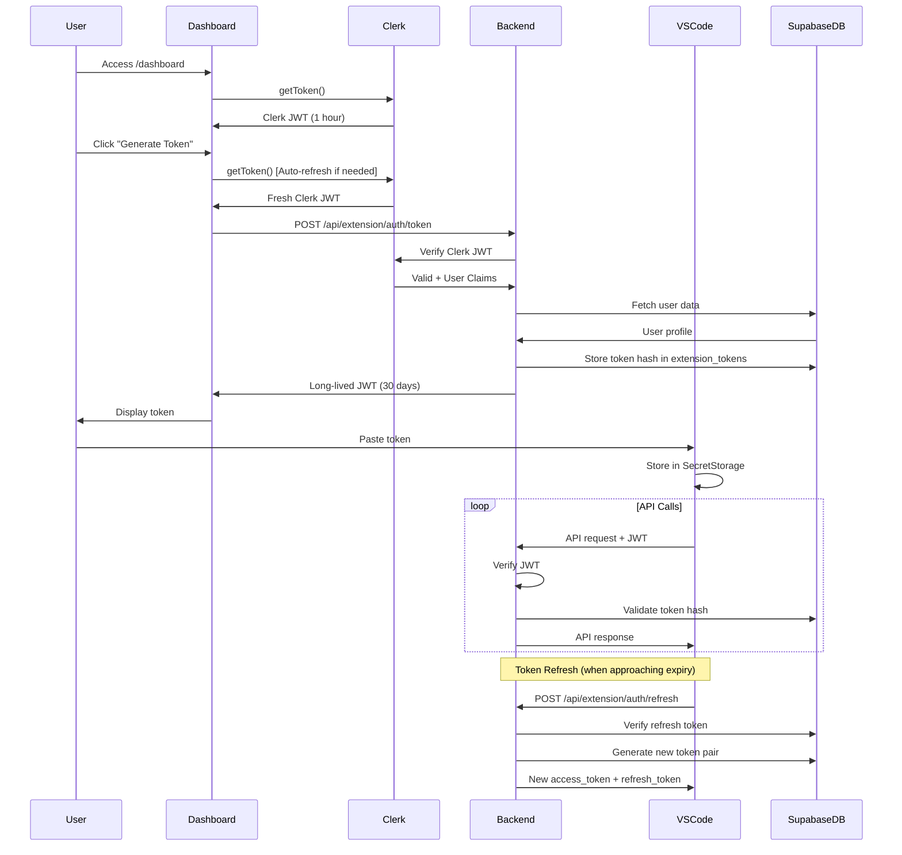

# JWT Token with Clerk Auto-Refresh Implementation Plan

## Overview

This document outlines the implementation plan for generating JWT tokens in the `/dashboard` using Clerk, which will be submitted to the VSCode extension. The key feature is **Clerk's automatic token refresh** to keep users continuously connected without manual re-authentication.

## Architecture Overview



---

## Part 1: Website (Dashboard) Implementation

### 1.1 Current State Analysis

**Existing Implementation:**
- [`src/pages/Dashboard.tsx`](src/pages/Dashboard.tsx:230-342) has basic token generation
- Uses [`api/extension/auth/token.ts`](api/extension/auth/token.ts) endpoint
- Currently returns Clerk token directly (short-lived)
- No proper token storage mechanism

**Issues to Address:**
1. Clerk tokens expire in ~1 hour (too short for VSCode extension)
2. No refresh mechanism for long-term use
3. No token tracking in database
4. No token revocation capability

### 1.2 Dashboard UI Enhancement

**File:** [`src/pages/Dashboard.tsx`](src/pages/Dashboard.tsx)

#### Changes Required:

1. **Token Display Section** (Lines 832-905)
   - Add token expiry countdown
   - Add auto-refresh indicator
   - Show token status (active/expired/revoked)
   - Add token history list

2. **Auto-Refresh Mechanism**
   ```typescript
   // Add new state
   const [tokenExpiresAt, setTokenExpiresAt] = useState<Date | null>(null);
   const [isAutoRefreshEnabled, setIsAutoRefreshEnabled] = useState(true);
   
   // Add useEffect for auto-refresh
   useEffect(() => {
     if (!isAutoRefreshEnabled || !tokenExpiresAt) return;
     
     const timeUntilExpiry = tokenExpiresAt.getTime() - Date.now();
     const refreshTime = timeUntilExpiry - (24 * 60 * 60 * 1000); // Refresh 1 day before expiry
     
     if (refreshTime > 0) {
       const timer = setTimeout(() => {
         refreshTokenAutomatically();
       }, refreshTime);
       
       return () => clearTimeout(timer);
     }
   }, [tokenExpiresAt, isAutoRefreshEnabled]);
   
   const refreshTokenAutomatically = async () => {
     try {
       const clerkToken = await getToken();
       // Call refresh endpoint
       const response = await fetch('/api/extension/auth/refresh', {
         method: 'POST',
         headers: {
           'Content-Type': 'application/json',
           'Authorization': `Bearer ${clerkToken}`
         },
         body: JSON.stringify({
           current_token: extensionToken
         })
       });
       
       const data = await response.json();
       if (data.success) {
         setExtensionToken(data.access_token);
         setTokenExpiresAt(new Date(data.expires_at));
         
         toast({
           title: "Token Refreshed",
           description: "Your VSCode extension token has been automatically refreshed",
         });
       }
     } catch (error) {
       console.error('Auto-refresh failed:', error);
     }
   };
   ```

3. **Enhanced Token Generation** (Update [`generateToken`](src/pages/Dashboard.tsx:230) function)
   ```typescript
   const generateToken = async () => {
     if (!user?.id) {
       toast({
         title: "Authentication Error",
         description: "User not authenticated",
         variant: "destructive",
       });
       return;
     }

     setIsGenerating(true);
     try {
       // Get fresh Clerk token (auto-refreshed by Clerk if needed)
       const clerkToken = await getToken({ 
         template: 'default',
         skipCache: true // Force fresh token
       });
       
       if (!clerkToken) {
         throw new Error('Failed to get Clerk authentication token');
       }
       
       // Generate long-lived backend JWT
       const response = await fetch('/api/extension/auth/token', {
         method: 'POST',
         headers: {
           'Content-Type': 'application/json',
           'Authorization': `Bearer ${clerkToken}`
         },
         body: JSON.stringify({
           token_name: 'VSCode Extension Token',
           duration_days: 30 // 30-day token
         })
       });
       
       if (!response.ok) {
         throw new Error(`Token generation failed: ${response.status}`);
       }
       
       const data = await response.json();
       
       if (data.success && data.access_token) {
         setExtensionToken(data.access_token);
         setTokenExpiresAt(new Date(data.expires_at));
         
         toast({
           title: "Token Generated",
           description: `Token valid for 30 days. Auto-refresh is ${isAutoRefreshEnabled ? 'enabled' : 'disabled'}.`,
         });
       }
     } catch (error) {
       console.error('Token generation error:', error);
       toast({
         title: "Token Generation Failed",
         description: error instanceof Error ? error.message : "Failed to generate token",
         variant: "destructive",
       });
     } finally {
       setIsGenerating(false);
     }
   };
   ```

4. **Token Management UI**
   ```typescript
   // Add token management section
   <Card className="bg-[#2a2a2a] border-white/10 p-6 mb-8">
     <h3 className="text-lg font-semibold text-white mb-4">Token Management</h3>
     
     {extensionToken && tokenExpiresAt && (
       <div className="space-y-3 mb-4">
         <div className="flex items-center justify-between">
           <span className="text-sm text-gray-400">Status:</span>
           <Badge variant="success">Active</Badge>
         </div>
         
         <div className="flex items-center justify-between">
           <span className="text-sm text-gray-400">Expires:</span>
           <span className="text-sm text-white">
             {tokenExpiresAt.toLocaleDateString()} at {tokenExpiresAt.toLocaleTimeString()}
           </span>
         </div>
         
         <div className="flex items-center justify-between">
           <span className="text-sm text-gray-400">Auto-Refresh:</span>
           <Switch
             checked={isAutoRefreshEnabled}
             onCheckedChange={setIsAutoRefreshEnabled}
           />
         </div>
       </div>
     )}
     
     <div className="flex gap-2">
       <Button
         onClick={revokeToken}
         variant="destructive"
         disabled={!extensionToken}
       >
         Revoke Token
       </Button>
       
       <Button
         onClick={viewTokenHistory}
         variant="outline"
       >
         View History
       </Button>
     </div>
   </Card>
   ```

### 1.3 Backend API Endpoints

#### 1.3.1 Token Generation Endpoint

**File:** [`api/extension/auth/token.ts`](api/extension/auth/token.ts)

**Required Changes:**

```typescript
import { verifyToken } from '@clerk/backend';
import { createClient } from '@supabase/supabase-js';
import type { NextApiRequest, NextApiResponse } from 'next';
import jwt from 'jsonwebtoken';
import crypto from 'crypto';

const EXTENSION_TOKEN_DURATION_DAYS = 30;
const REFRESH_TOKEN_DURATION_DAYS = 90;

export default async function handler(req: NextApiRequest, res: NextApiResponse) {
  if (req.method !== 'POST') {
    return res.status(405).json({ error: 'Method not allowed' });
  }

  try {
    // 1. Verify Clerk token
    const authHeader = req.headers.authorization;
    if (!authHeader?.startsWith('Bearer ')) {
      return res.status(401).json({ error: 'Missing or invalid Authorization header' });
    }

    const clerkToken = authHeader.substring(7);
    const claims = await verifyToken(clerkToken, {
      jwtKey: process.env.CLERK_SECRET_KEY!
    });

    const clerkId = claims.sub;
    if (!clerkId) {
      return res.status(401).json({ error: 'Invalid Clerk token' });
    }

    // 2. Fetch user from Supabase
    const supabase = createClient(
      process.env.SUPABASE_URL!,
      process.env.SUPABASE_SERVICE_ROLE_KEY!,
      {
        auth: {
          autoRefreshToken: false,
          persistSession: false
        }
      }
    );

    const { data: userData, error: userError } = await supabase
      .from('users')
      .select('id, clerk_id, email, plan_type, credits')
      .eq('clerk_id', clerkId)
      .single();

    if (userError || !userData) {
      return res.status(404).json({ error: 'User not found' });
    }

    // 3. Revoke existing active tokens (single token policy)
    const { error: revokeError } = await supabase.rpc(
      'revoke_user_extension_tokens',
      { p_user_id: userData.id }
    );

    if (revokeError) {
      console.error('Token revocation error:', revokeError);
    }

    // 4. Generate new access token
    const sessionId = crypto.randomUUID();
    const now = Math.floor(Date.now() / 1000);
    const expiresIn = EXTENSION_TOKEN_DURATION_DAYS * 24 * 60 * 60;
    
    const accessTokenPayload = {
      sub: userData.clerk_id,
      email: userData.email,
      session_id: sessionId,
      plan: userData.plan_type,
      type: 'access',
      iat: now,
      exp: now + expiresIn,
      iss: 'softcodes.ai',
      aud: 'vscode-extension'
    };
    
    const accessToken = jwt.sign(accessTokenPayload, process.env.JWT_SECRET!);

    // 5. Generate refresh token
    const refreshExpiresIn = REFRESH_TOKEN_DURATION_DAYS * 24 * 60 * 60;
    const refreshTokenPayload = {
      sub: userData.clerk_id,
      session_id: sessionId,
      type: 'refresh',
      iat: now,
      exp: now + refreshExpiresIn,
      iss: 'softcodes.ai',
      aud: 'vscode-extension'
    };
    
    const refreshToken = jwt.sign(refreshTokenPayload, process.env.JWT_SECRET!);

    // 6. Store token hash in database
    const tokenHash = crypto
      .createHash('sha256')
      .update(accessToken)
      .digest('hex');

    const { error: insertError } = await supabase
      .from('extension_tokens')
      .insert({
        user_id: userData.id,
        token_hash: tokenHash,
        name: req.body.token_name || 'VSCode Extension Token',
        expires_at: new Date((now + expiresIn) * 1000).toISOString()
      });

    if (insertError) {
      console.error('Token storage error:', insertError);
      return res.status(500).json({ error: 'Failed to store token' });
    }

    // 7. Return tokens
    res.status(200).json({
      success: true,
      access_token: accessToken,
      refresh_token: refreshToken,
      expires_in: expiresIn,
      expires_at: new Date((now + expiresIn) * 1000).toISOString(),
      token_type: 'Bearer',
      session_id: sessionId
    });

  } catch (error) {
    console.error('Token generation error:', error);
    res.status(500).json({ 
      error: 'Internal server error',
      details: error instanceof Error ? error.message : 'Unknown error'
    });
  }
}
```

#### 1.3.2 Token Refresh Endpoint

**File:** `api/extension/auth/refresh.ts` (NEW FILE)

```typescript
import { verifyToken } from '@clerk/backend';
import { createClient } from '@supabase/supabase-js';
import type { NextApiRequest, NextApiResponse } from 'next';
import jwt from 'jsonwebtoken';
import crypto from 'crypto';

const EXTENSION_TOKEN_DURATION_DAYS = 30;
const REFRESH_TOKEN_DURATION_DAYS = 90;

export default async function handler(req: NextApiRequest, res: NextApiResponse) {
  if (req.method !== 'POST') {
    return res.status(405).json({ error: 'Method not allowed' });
  }

  try {
    const { refresh_token, current_token } = req.body;

    if (!refresh_token) {
      return res.status(400).json({ error: 'Missing refresh_token' });
    }

    // 1. Verify refresh token
    let decoded: any;
    try {
      decoded = jwt.verify(refresh_token, process.env.JWT_SECRET!);
    } catch (error) {
      return res.status(401).json({ error: 'Invalid or expired refresh token' });
    }

    if (decoded.type !== 'refresh') {
      return res.status(401).json({ error: 'Invalid token type' });
    }

    // 2. Initialize Supabase
    const supabase = createClient(
      process.env.SUPABASE_URL!,
      process.env.SUPABASE_SERVICE_ROLE_KEY!,
      {
        auth: {
          autoRefreshToken: false,
          persistSession: false
        }
      }
    );

    // 3. Fetch user
    const { data: userData, error: userError } = await supabase
      .from('users')
      .select('id, clerk_id, email, plan_type')
      .eq('clerk_id', decoded.sub)
      .single();

    if (userError || !userData) {
      return res.status(404).json({ error: 'User not found' });
    }

    // 4. Revoke old token if provided
    if (current_token) {
      const oldTokenHash = crypto
        .createHash('sha256')
        .update(current_token)
        .digest('hex');

      await supabase
        .from('extension_tokens')
        .update({ revoked_at: new Date().toISOString() })
        .eq('token_hash', oldTokenHash)
        .eq('user_id', userData.id);
    }

    // 5. Generate new tokens
    const now = Math.floor(Date.now() / 1000);
    const expiresIn = EXTENSION_TOKEN_DURATION_DAYS * 24 * 60 * 60;
    const sessionId = decoded.session_id; // Maintain session ID
    
    const newAccessTokenPayload = {
      sub: userData.clerk_id,
      email: userData.email,
      session_id: sessionId,
      plan: userData.plan_type,
      type: 'access',
      iat: now,
      exp: now + expiresIn,
      iss: 'softcodes.ai',
      aud: 'vscode-extension'
    };
    
    const newAccessToken = jwt.sign(newAccessTokenPayload, process.env.JWT_SECRET!);

    // 6. Generate new refresh token
    const refreshExpiresIn = REFRESH_TOKEN_DURATION_DAYS * 24 * 60 * 60;
    const newRefreshTokenPayload = {
      sub: userData.clerk_id,
      session_id: sessionId,
      type: 'refresh',
      iat: now,
      exp: now + refreshExpiresIn,
      iss: 'softcodes.ai',
      aud: 'vscode-extension'
    };
    
    const newRefreshToken = jwt.sign(newRefreshTokenPayload, process.env.JWT_SECRET!);

    // 7. Store new token hash
    const tokenHash = crypto
      .createHash('sha256')
      .update(newAccessToken)
      .digest('hex');

    await supabase
      .from('extension_tokens')
      .insert({
        user_id: userData.id,
        token_hash: tokenHash,
        name: 'VSCode Extension Token (Refreshed)',
        expires_at: new Date((now + expiresIn) * 1000).toISOString()
      });

    // 8. Return new tokens
    res.status(200).json({
      success: true,
      access_token: newAccessToken,
      refresh_token: newRefreshToken,
      expires_in: expiresIn,
      expires_at: new Date((now + expiresIn) * 1000).toISOString(),
      token_type: 'Bearer'
    });

  } catch (error) {
    console.error('Token refresh error:', error);
    res.status(500).json({ 
      error: 'Internal server error',
      details: error instanceof Error ? error.message : 'Unknown error'
    });
  }
}
```

#### 1.3.3 Token Revocation Endpoint

**File:** `api/extension/auth/revoke.ts` (NEW FILE)

```typescript
import { verifyToken } from '@clerk/backend';
import { createClient } from '@supabase/supabase-js';
import type { NextApiRequest, NextApiResponse } from 'next';
import crypto from 'crypto';

export default async function handler(req: NextApiRequest, res: NextApiResponse) {
  if (req.method !== 'POST') {
    return res.status(405).json({ error: 'Method not allowed' });
  }

  try {
    // 1. Verify Clerk token
    const authHeader = req.headers.authorization;
    if (!authHeader?.startsWith('Bearer ')) {
      return res.status(401).json({ error: 'Missing authorization header' });
    }

    const clerkToken = authHeader.substring(7);
    const claims = await verifyToken(clerkToken, {
      jwtKey: process.env.CLERK_SECRET_KEY!
    });

    const clerkId = claims.sub;
    if (!clerkId) {
      return res.status(401).json({ error: 'Invalid token' });
    }

    // 2. Initialize Supabase
    const supabase = createClient(
      process.env.SUPABASE_URL!,
      process.env.SUPABASE_SERVICE_ROLE_KEY!
    );

    // 3. Get user ID
    const { data: userData } = await supabase
      .from('users')
      .select('id')
      .eq('clerk_id', clerkId)
      .single();

    if (!userData) {
      return res.status(404).json({ error: 'User not found' });
    }

    // 4. Revoke all active tokens or specific token
    const { token_to_revoke } = req.body;

    if (token_to_revoke) {
      // Revoke specific token
      const tokenHash = crypto
        .createHash('sha256')
        .update(token_to_revoke)
        .digest('hex');

      const { error } = await supabase
        .from('extension_tokens')
        .update({ revoked_at: new Date().toISOString() })
        .eq('token_hash', tokenHash)
        .eq('user_id', userData.id);

      if (error) {
        throw error;
      }
    } else {
      // Revoke all active tokens
      const { error } = await supabase.rpc(
        'revoke_user_extension_tokens',
        { p_user_id: userData.id }
      );

      if (error) {
        throw error;
      }
    }

    res.status(200).json({
      success: true,
      message: 'Token(s) revoked successfully'
    });

  } catch (error) {
    console.error('Token revocation error:', error);
    res.status(500).json({ 
      error: 'Internal server error',
      details: error instanceof Error ? error.message : 'Unknown error'
    });
  }
}
```

#### 1.3.4 Token Validation Endpoint

**File:** `api/extension/auth/validate.ts` (NEW FILE)

```typescript
import { createClient } from '@supabase/supabase-js';
import type { NextApiRequest, NextApiResponse } from 'next';
import jwt from 'jsonwebtoken';
import crypto from 'crypto';

export default async function handler(req: NextApiRequest, res: NextApiResponse) {
  if (req.method !== 'POST') {
    return res.status(405).json({ error: 'Method not allowed' });
  }

  try {
    // 1. Extract token
    const authHeader = req.headers.authorization;
    if (!authHeader?.startsWith('Bearer ')) {
      return res.status(401).json({ 
        valid: false, 
        error: 'Missing authorization header' 
      });
    }

    const token = authHeader.substring(7);

    // 2. Verify JWT signature and expiry
    let decoded: any;
    try {
      decoded = jwt.verify(token, process.env.JWT_SECRET!, {
        algorithms: ['HS256'],
        clockTolerance: 5
      });
    } catch (error) {
      return res.status(401).json({ 
        valid: false, 
        error: 'Invalid or expired token' 
      });
    }

    // 3. Validate token type
    if (decoded.type !== 'access') {
      return res.status(401).json({ 
        valid: false, 
        error: 'Invalid token type' 
      });
    }

    // 4. Initialize Supabase
    const supabase = createClient(
      process.env.SUPABASE_URL!,
      process.env.SUPABASE_SERVICE_ROLE_KEY!
    );

    // 5. Verify token hash exists and not revoked
    const tokenHash = crypto
      .createHash('sha256')
      .update(token)
      .digest('hex');

    const { data: tokenRecord, error: tokenError } = await supabase
      .from('extension_tokens')
      .select('id, user_id, expires_at, revoked_at, last_used_at')
      .eq('token_hash', tokenHash)
      .single();

    if (tokenError || !tokenRecord) {
      return res.status(401).json({ 
        valid: false, 
        error: 'Token not found' 
      });
    }

    // 6. Check if revoked
    if (tokenRecord.revoked_at) {
      return res.status(401).json({ 
        valid: false, 
        error: 'Token has been revoked' 
      });
    }

    // 7. Check expiry
    if (new Date(tokenRecord.expires_at) < new Date()) {
      return res.status(401).json({ 
        valid: false, 
        error: 'Token has expired' 
      });
    }

    // 8. Update last used timestamp
    await supabase
      .from('extension_tokens')
      .update({ last_used_at: new Date().toISOString() })
      .eq('id', tokenRecord.id);

    // 9. Fetch user data
    const { data: userData, error: userError } = await supabase
      .from('users')
      .select('clerk_id, email, plan_type, credits')
      .eq('id', tokenRecord.user_id)
      .single();

    if (userError || !userData) {
      return res.status(404).json({ 
        valid: false, 
        error: 'User not found' 
      });
    }

    // 10. Return validation result
    res.status(200).json({
      valid: true,
      userId: userData.clerk_id,
      email: userData.email,
      plan: userData.plan_type,
      credits: userData.credits
    });

  } catch (error) {
    console.error('Token validation error:', error);
    res.status(500).json({ 
      valid: false,
      error: 'Internal server error'
    });
  }
}
```

---

## Part 2: VSCode Extension Implementation

### 2.1 Authentication Flow Architecture

The VSCode extension needs to:
1. Allow users to paste the token from the dashboard
2. Store the token securely
3. Use the token for all API requests
4. Automatically refresh the token before expiry
5. Handle token revocation gracefully

### 2.2 Token Storage Service

**File:** `src/services/tokenStorage.ts` (NEW FILE)

```typescript
import * as vscode from 'vscode';

const TOKEN_KEY = 'softcodes.accessToken';
const REFRESH_TOKEN_KEY = 'softcodes.refreshToken';
const TOKEN_EXPIRY_KEY = 'softcodes.tokenExpiry';
const SESSION_ID_KEY = 'softcodes.sessionId';

export class TokenStorageService {
  constructor(private context: vscode.ExtensionContext) {}

  async storeTokens(
    accessToken: string,
    refreshToken: string,
    expiresAt: string,
    sessionId: string
  ): Promise<void> {
    await this.context.secrets.store(TOKEN_KEY, accessToken);
    await this.context.secrets.store(REFRESH_TOKEN_KEY, refreshToken);
    await this.context.globalState.update(TOKEN_EXPIRY_KEY, expiresAt);
    await this.context.globalState.update(SESSION_ID_KEY, sessionId);
  }

  async getAccessToken(): Promise<string | undefined> {
    return await this.context.secrets.get(TOKEN_KEY);
  }

  async getRefreshToken(): Promise<string | undefined> {
    return await this.context.secrets.get(REFRESH_TOKEN_KEY);
  }

  async getTokenExpiry(): Promise<string | undefined> {
    return this.context.globalState.get<string>(TOKEN_EXPIRY_KEY);
  }

  async getSessionId(): Promise<string | undefined> {
    return this.context.globalState.get<string>(SESSION_ID_KEY);
  }

  async clearTokens(): Promise<void> {
    await this.context.secrets.delete(TOKEN_KEY);
    await this.context.secrets.delete(REFRESH_TOKEN_KEY);
    await this.context.globalState.update(TOKEN_EXPIRY_KEY, undefined);
    await this.context.globalState.update(SESSION_ID_KEY, undefined);
  }

  async isTokenExpired(): Promise<boolean> {
    const expiry = await this.getTokenExpiry();
    if (!expiry) return true;

    const expiryDate = new Date(expiry);
    const now = new Date();
    
    // Consider expired if less than 1 day remaining
    const oneDayInMs = 24 * 60 * 60 * 1000;
    return (expiryDate.getTime() - now.getTime()) < oneDayInMs;
  }
}
```

### 2.3 Authentication Service

**File:** `src/services/authService.ts` (NEW FILE)

```typescript
import * as vscode from 'vscode';
import { TokenStorageService } from './tokenStorage';
import jwt from 'jsonwebtoken';

const API_BASE_URL = process.env.NODE_ENV === 'production'
  ? 'https://www.softcodes.ai/api/extension'
  : 'http://localhost:3000/api/extension';

export class AuthService {
  private tokenStorage: TokenStorageService;
  private refreshTimer: NodeJS.Timeout | null = null;

  constructor(context: vscode.ExtensionContext) {
    this.tokenStorage = new TokenStorageService(context);
  }

  /**
   * Authenticate with token from dashboard
   */
  async authenticateWithToken(token: string): Promise<boolean> {
    try {
      // Decode token to get expiry and session info
      const decoded = this.decodeToken(token);
      
      if (!decoded || decoded.type !== 'access') {
        vscode.window.showErrorMessage('Invalid token format');
        return false;
      }

      // Validate token with backend
      const isValid = await this.validateToken(token);
      
      if (!isValid) {
        vscode.window.showErrorMessage('Token validation failed');
        return false;
      }

      // Note: We need the refresh token too
      // The user should paste both tokens or we get it from the dashboard
      const refreshToken = await vscode.window.showInputBox({
        prompt: 'Please enter the refresh token',
        password: true,
        ignoreFocusOut: true
      });

      if (!refreshToken) {
        vscode.window.showErrorMessage('Refresh token is required');
        return false;
      }

      // Store tokens
      const expiresAt = new Date(decoded.exp * 1000).toISOString();
      await this.tokenStorage.storeTokens(
        token,
        refreshToken,
        expiresAt,
        decoded.session_id
      );

      // Setup auto-refresh
      this.setupAutoRefresh();

      vscode.window.showInformationMessage('Successfully authenticated!');
      return true;

    } catch (error) {
      console.error('Authentication error:', error);
      vscode.window.showErrorMessage(
        `Authentication failed: ${error instanceof Error ? error.message : 'Unknown error'}`
      );
      return false;
    }
  }

  /**
   * Decode JWT without verification (for reading payload)
   */
  private decodeToken(token: string): any {
    try {
      const parts = token.split('.');
      if (parts.length !== 3) {
        throw new Error('Invalid JWT format');
      }

      const payload = parts[1];
      const decoded = Buffer.from(payload, 'base64').toString('utf8');
      return JSON.parse(decoded);
    } catch (error) {
      console.error('Token decode error:', error);
      return null;
    }
  }

  /**
   * Validate token with backend
   */
  private async validateToken(token: string): Promise<boolean> {
    try {
      const response = await fetch(`${API_BASE_URL}/auth/validate`, {
        method: 'POST',
        headers: {
          'Authorization': `Bearer ${token}`,
          'Content-Type': 'application/json'
        }
      });

      const data = await response.json();
      return data.valid === true;
    } catch (error) {
      console.error('Token validation error:', error);
      return false;
    }
  }

  /**
   * Setup automatic token refresh
   */
  private async setupAutoRefresh(): Promise<void> {
    // Clear existing timer
    if (this.refreshTimer) {
      clearTimeout(this.refreshTimer);
    }

    const expiry = await this.tokenStorage.getTokenExpiry();
    if (!expiry) return;

    const expiryDate = new Date(expiry);
    const now = new Date();
    
    // Refresh 1 day before expiry
    const refreshTime = expiryDate.getTime() - now.getTime() - (24 * 60 * 60 * 1000);

    if (refreshTime > 0) {
      this.refreshTimer = setTimeout(async () => {
        await this.refreshAccessToken();
      }, refreshTime);

      console.log(`Auto-refresh scheduled in ${Math.floor(refreshTime / 1000 / 60 / 60)} hours`);
    } else {
      // Token expires soon, refresh immediately
      await this.refreshAccessToken();
    }
  }

  /**
   * Refresh access token
   */
  async refreshAccessToken(): Promise<boolean> {
    try {
      const refreshToken = await this.tokenStorage.getRefreshToken();
      const currentToken = await this.tokenStorage.getAccessToken();

      if (!refreshToken) {
        throw new Error('No refresh token available');
      }

      const response = await fetch(`${API_BASE_URL}/auth/refresh`, {
        method: 'POST',
        headers: {
          'Content-Type': 'application/json'
        },
        body: JSON.stringify({
          refresh_token: refreshToken,
          current_token: currentToken
        })
      });

      if (!response.ok) {
        throw new Error(`Refresh failed: ${response.status}`);
      }

      const data = await response.json();

      if (data.success && data.access_token && data.refresh_token) {
        // Store new tokens
        const decoded = this.decodeToken(data.access_token);
        await this.tokenStorage.storeTokens(
          data.access_token,
          data.refresh_token,
          data.expires_at,
          decoded.session_id
        );

        // Reschedule auto-refresh
        this.setupAutoRefresh();

        vscode.window.showInformationMessage('Authentication token refreshed automatically');
        return true;
      }

      throw new Error('Invalid refresh response');

    } catch (error) {
      console.error('Token refresh error:', error);
      vscode.window.showErrorMessage(
        `Token refresh failed. Please re-authenticate.`
      );
      
      // Clear invalid tokens
      await this.tokenStorage.clearTokens();
      return false;
    }
  }

  /**
   * Get current access token
   */
  async getAccessToken(): Promise<string | null> {
    // Check if token exists
    const token = await this.tokenStorage.getAccessToken();
    if (!token) return null;

    // Check if expired
    const isExpired = await this.tokenStorage.isTokenExpired();
    if (isExpired) {
      // Try to refresh
      const refreshed = await this.refreshAccessToken();
      if (!refreshed) return null;
      
      // Get new token
      return await this.tokenStorage.getAccessToken() || null;
    }

    return token;
  }

  /**
   * Sign out
   */
  async signOut(): Promise<void> {
    await this.tokenStorage.clearTokens();
    
    if (this.refreshTimer) {
      clearTimeout(this.refreshTimer);
      this.refreshTimer = null;
    }

    vscode.window.showInformationMessage('Signed out successfully');
  }

  /**
   * Check if authenticated
   */
  async isAuthenticated(): Promise<boolean> {
    const token = await this.getAccessToken();
    return token !== null;
  }
}
```

### 2.4 API Request Service

**File:** `src/services/apiService.ts` (NEW FILE)

```typescript
import * as vscode from 'vscode';
import { AuthService } from './authService';

const API_BASE_URL = process.env.NODE_ENV === 'production'
  ? 'https://www.softcodes.ai/api/extension'
  : 'http://localhost:3000/api/extension';

export class ApiService {
  constructor(private authService: AuthService) {}

  /**
   * Make authenticated API request
   */
  async request<T>(
    endpoint: string,
    options: RequestInit = {}
  ): Promise<T> {
    const token = await this.authService.getAccessToken();
    
    if (!token) {
      throw new Error('Not authenticated');
    }

    const url = `${API_BASE_URL}${endpoint}`;
    
    const response = await fetch(url, {
      ...options,
      headers: {
        'Authorization': `Bearer ${token}`,
        'Content-Type': 'application/json',
        ...options.headers
      }
    });

    // Handle 401 Unauthorized
    if (response.status === 401) {
      // Try to refresh token
      const refreshed = await this.authService.refreshAccessToken();
      
      if (refreshed) {
        // Retry request with new token
        const newToken = await this.authService.getAccessToken();
        if (newToken) {
          const retryResponse = await fetch(url, {
            ...options,
            headers: {
              'Authorization': `Bearer ${newToken}`,
              'Content-Type': 'application/json',
              ...options.headers
            }
          });

          if (!retryResponse.ok) {
            throw new Error(`API request failed: ${retryResponse.status}`);
          }

          return await retryResponse.json();
        }
      }
      
      throw new Error('Authentication failed. Please sign in again.');
    }

    if (!response.ok) {
      throw new Error(`API request failed: ${response.status}`);
    }

    return await response.json();
  }

  /**
   * Validate session
   */
  async validateSession(sessionToken: string): Promise<any> {
    return this.request('/vscode/session/validate', {
      method: 'POST',
      body: JSON.stringify({
        sessionToken,
        extensionVersion: vscode.extensions.getExtension('softcodes.softcodes-ai')?.packageJSON.version
      })
    });
  }

  /**
   * Track usage
   */
  async trackUsage(data: {
    sessionToken: string;
    action: string;
    modelId: string;
    tokensUsed: number;
    costInCredits: number;
  }): Promise<any> {
    return this.request('/vscode/usage/track', {
      method: 'POST',
      body: JSON.stringify(data)
    });
  }

  /**
   * Get analytics
   */
  async getAnalytics(timeframe: '1d' | '7d' | '30d' = '7d'): Promise<any> {
    return this.request(`/vscode/analytics?timeframe=${timeframe}`);
  }
}
```

### 2.5 Extension Commands

**File:** `src/extension.ts` (UPDATE)

```typescript
import * as vscode from 'vscode';
import { AuthService } from './services/authService';
import { ApiService } from './services/apiService';

let authService: AuthService;
let apiService: ApiService;

export function activate(context: vscode.ExtensionContext) {
  console.log('Softcodes.ai extension is now active');

  // Initialize services
  authService = new AuthService(context);
  apiService = new ApiService(authService);

  // Register authenticate command
  const authenticateCommand = vscode.commands.registerCommand(
    'softcodes.authenticate',
    async () => {
      const token = await vscode.window.showInputBox({
        prompt: 'Enter your authentication token from the Softcodes.ai dashboard',
        password: true,
        ignoreFocusOut: true,
        placeHolder: 'Paste your token here...'
      });

      if (token) {
        await authService.authenticateWithToken(token);
      }
    }
  );

  // Register sign out command
  const signOutCommand = vscode.commands.registerCommand(
    'softcodes.signOut',
    async () => {
      await authService.signOut();
    }
  );

  // Register refresh token command
  const refreshCommand = vscode.commands.registerCommand(
    'softcodes.refreshToken',
    async () => {
      const success = await authService.refreshAccessToken();
      if (success) {
        vscode.window.showInformationMessage('Token refreshed successfully');
      }
    }
  );

  // Register view status command
  const statusCommand = vscode.commands.registerCommand(
    'softcodes.viewStatus',
    async () => {
      const isAuth = await authService.isAuthenticated();
      
      if (isAuth) {
        const expiry = await authService['tokenStorage'].getTokenExpiry();
        vscode.window.showInformationMessage(
          `Authenticated. Token expires: ${new Date(expiry!).toLocaleString()}`
        );
      } else {
        vscode.window.showWarningMessage('Not authenticated');
      }
    }
  );

  context.subscriptions.push(
    authenticateCommand,
    signOutCommand,
    refreshCommand,
    statusCommand
  );

  // Check authentication status on activation
  checkAuthStatus();
}

async function checkAuthStatus() {
  const isAuth = await authService.isAuthenticated();
  
  if (!isAuth) {
    const result = await vscode.window.showInformationMessage(
      'Softcodes.ai: Please authenticate to use the extension',
      'Authenticate'
    );
    
    if (result === 'Authenticate') {
      vscode.commands.executeCommand('softcodes.authenticate');
    }
  }
}

export function deactivate() {
  console.log('Softcodes.ai extension is now deactivated');
}
```

### 2.6 Package.json Updates

**File:** `package.json` (UPDATE)

```json
{
  "contributes": {
    "commands": [
      {
        "command": "softcodes.authenticate",
        "title": "Softcodes: Authenticate"
      },
      {
        "command": "softcodes.signOut",
        "title": "Softcodes: Sign Out"
      },
      {
        "command": "softcodes.refreshToken",
        "title": "Softcodes: Refresh Token"
      },
      {
        "command": "softcodes.viewStatus",
        "title": "Softcodes: View Authentication Status"
      }
    ],
    "configuration": {
      "title": "Softcodes.ai",
      "properties": {
        "softcodes.apiBaseUrl": {
          "type": "string",
          "default": "https://www.softcodes.ai/api/extension",
          "description": "API base URL"
        },
        "softcodes.autoRefresh": {
          "type": "boolean",
          "default": true,
          "description": "Automatically refresh tokens before expiry"
        }
      }
    }
  }
}
```

---

## Part 3: Clerk Auto-Refresh Mechanism

### 3.1 How Clerk Auto-Refresh Works

Clerk automatically handles token refresh in the browser:

1. **Initial Token**: When [`getToken()`](src/pages/Dashboard.tsx:250) is called, Clerk returns a JWT valid for ~1 hour
2. **Automatic Refresh**: Clerk's SDK automatically refreshes the token before it expires
3. **Seamless Updates**: When you call [`getToken()`](src/pages/Dashboard.tsx:250) again, you always get a fresh token
4. **No Manual Intervention**: The dashboard doesn't need to manually refresh Clerk tokens

### 3.2 Implementation in Dashboard

```typescript
// Clerk automatically handles token refresh
// Just call getToken() whenever you need a fresh token

// Example: Generate extension token
const clerkToken = await getToken({ skipCache: true }); // Always fresh

// Example: Periodic refresh (optional)
useEffect(() => {
  const interval = setInterval(async () => {
    // Get fresh Clerk token
    const freshToken = await getToken({ skipCache: true });
    
    // Could use this to refresh extension token if needed
    // But extension token is long-lived (30 days)
  }, 30 * 60 * 1000); // Every 30 minutes

  return () => clearInterval(interval);
}, [getToken]);
```

### 3.3 Token Lifecycle Flow

```
User Signs In
     ↓
Clerk Issues Session (auto-refresh enabled)
     ↓
User Clicks "Generate Token"
     ↓
Dashboard calls getToken() → Clerk returns fresh JWT
     ↓
Backend verifies Clerk JWT
     ↓
Backend generates 30-day extension JWT
     ↓
User pastes to VSCode
     ↓
VSCode stores token + refresh token
     ↓
VSCode uses token for API calls
     ↓
(After ~29 days)
     ↓
VSCode auto-refreshes token
     ↓
New 30-day token issued
     ↓
Cycle continues
```

---

## Part 4: Security Considerations

### 4.1 Token Security

1. **Storage**:
   - Website: Tokens only in memory (React state)
   - VSCode: Use `SecretStorage` API for secure storage
   - Database: Store only SHA-256 hashes, never plain tokens

2. **Transmission**:
   - Always use HTTPS in production
   - Bearer token in Authorization header
   - Never log full tokens

3. **Expiration**:
   - Access tokens: 30 days
   - Refresh tokens: 90 days
   - Clerk tokens: ~1 hour (handled by Clerk)

### 4.2 Token Revocation

1. **User-Initiated**: Revoke button in dashboard
2. **System-Initiated**: On password change or security breach
3. **Single Token Policy**: New token revokes previous ones
4. **Database Cleanup**: Periodic cleanup of expired tokens

### 4.3 Rate Limiting

Implement rate limiting on:
- Token generation: 5 per hour per user
- Token refresh: 10 per hour per user
- API endpoints: Based on plan type

---

## Part 5: Testing Strategy

### 5.1 Website Testing

1. **Unit Tests**:
   - Token generation logic
   - Auto-refresh timer
   - Token display/copy functionality

2. **Integration Tests**:
   - Full token generation flow
   - Clerk token verification
   - Database token storage

3. **E2E Tests**:
   - User generates token
   - Token copied to clipboard
   - Token displayed with expiry

### 5.2 VSCode Extension Testing

1. **Unit Tests**:
   - Token storage service
   - JWT decoding
   - Auto-refresh logic

2. **Integration Tests**:
   - Authentication flow
   - API requests with tokens
   - Token refresh on 401

3. **Manual Testing**:
   - Install extension
   - Paste token
   - Make API calls
   - Verify auto-refresh

---

## Part 6: Deployment Checklist

### 6.1 Backend Deployment

- [ ] Add new API endpoints to Vercel
- [ ] Set JWT_SECRET environment variable
- [ ] Deploy database migrations
- [ ] Test token generation endpoint
- [ ] Test token refresh endpoint
- [ ] Test token validation endpoint
- [ ] Configure CORS for VSCode requests

### 6.2 Frontend Deployment

- [ ] Update Dashboard component
- [ ] Add token management UI
- [ ] Test auto-refresh timer
- [ ] Test token copy functionality
- [ ] Deploy to production

### 6.3 VSCode Extension Deployment

- [ ] Update extension code
- [ ] Add new services
- [ ] Update package.json
- [ ] Test authentication flow
- [ ] Test auto-refresh
- [ ] Package extension
- [ ] Publish to marketplace

---

## Part 7: Monitoring and Maintenance

### 7.1 Metrics to Track

1. **Token Metrics**:
   - Tokens generated per day
   - Active tokens count
   - Revoked tokens count
   - Token refresh success rate

2. **Usage Metrics**:
   - API calls per token
   - Token validation failures
   - Average token lifetime

3. **Error Metrics**:
   - Token generation failures
   - Refresh failures
   - Validation failures

### 7.2 Alerting

Set up alerts for:
- High token generation failure rate (>5%)
- High refresh failure rate (>10%)
- Unusual token revocation patterns
- JWT_SECRET exposure indicators

---

## Summary

This implementation provides:

✅ **Long-lived tokens** (30 days) for VSCode extension
✅ **Automatic refresh** in both dashboard (Clerk) and extension
✅ **Secure storage** with SHA-256 hashing in database
✅ **Token revocation** capability
✅ **Single token policy** (one active token per user)
✅ **Seamless user experience** with minimal re-authentication

The key innovation is leveraging **Clerk's automatic token refresh** on the website side, combined with **custom long-lived JWTs** for the extension side, providing the best of both worlds: security and convenience.