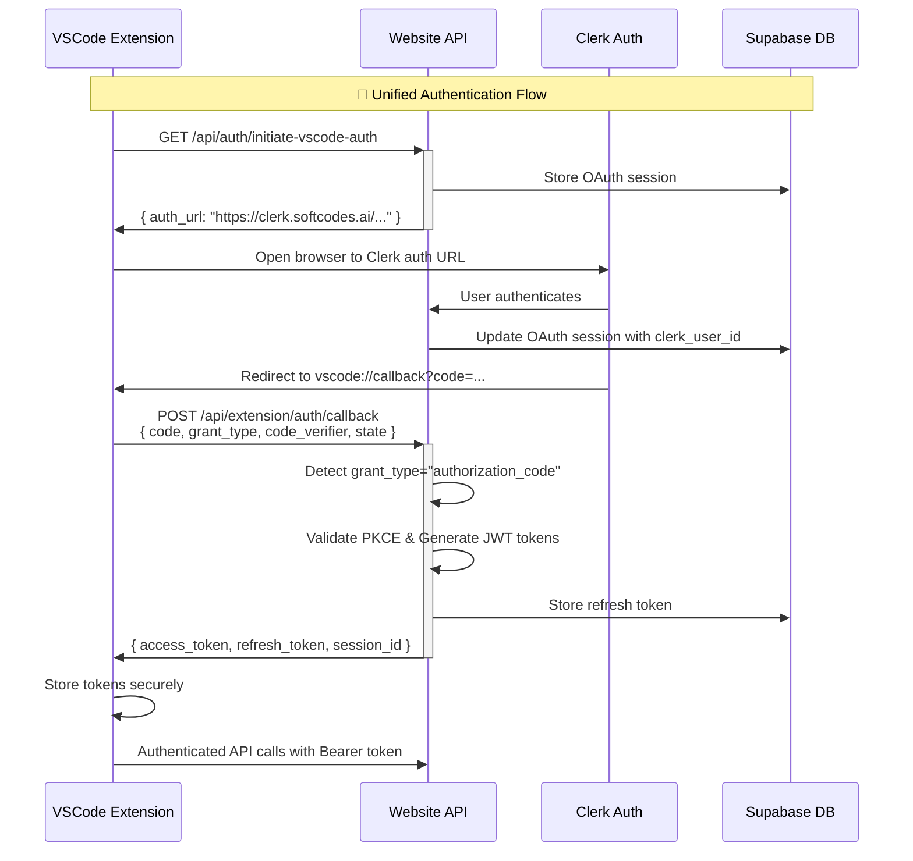

# VSCode Extension Authentication Bridge Documentation

## Overview

This document describes the unified authentication architecture that bridges the Blue Byte Booster website (Clerk-based) with the VSCode extension authentication system. The bridge maintains compatibility with both systems while providing a seamless authentication experience.

## Architecture Diagram



## Core Components

### 1. Authentication Bridge Logic

**File**: [`api/extension/auth/callback.ts`](api/extension/auth/callback.ts)

The callback endpoint now supports dual format detection:

- **VSCode Format**: `{ code, grant_type: "authorization_code", code_verifier, state }`
- **Website Format**: `{ state, code, clerk_user_id, redirect_uri }`

```typescript
// Bridge Logic: Detect format by grant_type
if (grant_type === "authorization_code") {
  return await handleVSCodeFlow(...)  // Returns JWT tokens
} else {
  return await handleWebsiteFlow(...)  // Returns redirect URL
}
```

### 2. JWT Token Generation

**File**: [`api/utils/jwt.ts`](api/utils/jwt.ts)

Provides secure token generation and validation:

```typescript
// Access Token (24 hours)
const accessToken = generateJWT(userData, sessionId)

// Refresh Token (30 days)  
const refreshToken = generateRefreshToken(userData, sessionId)

// PKCE Validation
const isValid = await validatePKCE(codeVerifier, codeChallenge)
```

### 3. Token Exchange Endpoint

**File**: [`api/auth/token.ts`](api/auth/token.ts)

Handles refresh token flow for long-lived sessions:

```typescript
// OAuth2 compliant token refresh
POST /api/auth/token
{
  "grant_type": "refresh_token",
  "refresh_token": "eyJ..."
}
```

### 4. Session Validation Bridge

**File**: [`api/auth/session-token.ts`](api/auth/session-token.ts)

Provides session validation for VSCode extension:

```typescript
POST /api/auth/session-token
{
  "session_id": "uuid",
  "access_token": "eyJ..."
}
```

### 5. Clerk User Sync Webhook

**File**: [`api/webhooks/clerk.ts`](api/webhooks/clerk.ts)

Automatically syncs Clerk users to Supabase:

- `user.created` → Auto-create user with starter plan (25 credits)
- `user.updated` → Update user information
- `user.deleted` → Clean up user data and sessions

## API Endpoints

### Authentication Flow

| Endpoint | Method | Purpose | Format |
|----------|---------|---------|---------|
| `/api/auth/initiate-vscode-auth` | GET | Start OAuth flow | Returns absolute Clerk URL |
| `/api/extension/auth/callback` | POST | Handle OAuth callback | Dual format support |
| `/api/auth/token` | POST | Token exchange/refresh | OAuth2 compliant |
| `/api/auth/session-token` | POST | Session validation | VSCode compatibility |

### Response Formats

#### VSCode Extension Response
```json
{
  "access_token": "eyJhbGciOiJIUzI1NiIs...",
  "refresh_token": "eyJhbGciOiJIUzI1NiIs...",
  "session_id": "uuid-v4",
  "organization_id": "org_123",
  "token_type": "Bearer",
  "expires_in": 86400
}
```

#### Website Response (Maintained)
```json
{
  "success": true,
  "redirect_url": "vscode://callback?code=abc&state=xyz",
  "message": "Authentication successful"
}
```

## Environment Configuration

### Required Environment Variables

```bash
# Clerk Authentication
VITE_CLERK_PUBLISHABLE_KEY=pk_live_your_clerk_publishable_key_here
CLERK_SECRET_KEY=sk_live_your_clerk_secret_key_here
NEXT_PUBLIC_CLERK_FRONTEND_API=https://clerk.softcodes.ai

# JWT Configuration
JWT_SECRET=your_jwt_secret_key_here_change_in_production

# Webhook Configuration
CLERK_WEBHOOK_SECRET=whsec_your_clerk_webhook_secret_here

# App URLs
VITE_APP_URL=https://softcodes.ai
NEXT_PUBLIC_APP_URL=https://softcodes.ai

# Supabase
VITE_SUPABASE_URL=https://your_supabase_url.supabase.co
SUPABASE_SERVICE_ROLE_KEY=your_supabase_service_role_key_here
```

### VSCode Extension Configuration

The VSCode extension should be configured to use:

```typescript
// src/auth/config.ts
export const PRODUCTION_CLERK_BASE_URL = "https://clerk.softcodes.ai"
export const PRODUCTION_ROO_CODE_API_URL = "https://softcodes.ai"
```

## Database Schema

### Required Tables

```sql
-- OAuth session storage
CREATE TABLE oauth_codes (
  id UUID PRIMARY KEY DEFAULT gen_random_uuid(),
  code TEXT NOT NULL UNIQUE,
  state TEXT NOT NULL,
  code_verifier TEXT,
  code_challenge TEXT,
  redirect_uri TEXT NOT NULL,
  clerk_user_id TEXT,
  expires_at TIMESTAMPTZ NOT NULL,
  created_at TIMESTAMPTZ DEFAULT NOW()
);

-- Refresh token storage
CREATE TABLE refresh_tokens (
  id UUID PRIMARY KEY DEFAULT gen_random_uuid(),
  clerk_user_id TEXT NOT NULL,
  token TEXT NOT NULL UNIQUE,
  session_id TEXT NOT NULL,
  expires_at TIMESTAMPTZ NOT NULL,
  created_at TIMESTAMPTZ DEFAULT NOW()
);

-- Indexes for performance
CREATE INDEX idx_oauth_codes_code ON oauth_codes(code);
CREATE INDEX idx_oauth_codes_state ON oauth_codes(state);
CREATE INDEX idx_refresh_tokens_token ON refresh_tokens(token);
CREATE INDEX idx_refresh_tokens_session_id ON refresh_tokens(session_id);
```

## Security Considerations

### PKCE Implementation
- **Code Verifier**: 32-byte random string, base64url encoded
- **Code Challenge**: SHA256 hash of verifier, base64url encoded
- **Validation**: Server validates verifier against stored challenge

### JWT Security
- **Algorithm**: HS256 with strong secret
- **Expiration**: Access tokens (24h), Refresh tokens (30d)
- **Claims**: Standard + custom fields (session_id, org_id)

### Token Storage
- **VSCode**: Uses secure `context.secrets` storage
- **Database**: Refresh tokens hashed and indexed
- **Transmission**: HTTPS only, proper CORS headers

## Testing

### End-to-End Test Script

Run the comprehensive test suite:

```bash
node test-vscode-auth-bridge.js
```

This tests:
- OAuth initiation with absolute URLs
- Dual format callback detection
- VSCode/Website compatibility
- Token exchange functionality
- Session validation bridge

### Manual Testing Checklist

1. **VSCode Extension Flow**:
   - [ ] Extension initiates auth correctly
   - [ ] Browser opens to Clerk auth URL
   - [ ] User authenticates via Clerk
   - [ ] Callback returns JWT tokens
   - [ ] Extension stores tokens securely
   - [ ] API calls work with Bearer token

2. **Website Flow (Compatibility)**:
   - [ ] Website auth still works
   - [ ] OAuth callback returns redirect URL
   - [ ] No breaking changes to existing flow

3. **Token Management**:
   - [ ] Access tokens expire correctly (24h)
   - [ ] Refresh tokens work for renewal
   - [ ] Session validation returns user info
   - [ ] Expired tokens are cleaned up

## Troubleshooting

### Common Issues

#### 1. "Invalid redirect URI" Error
**Cause**: VSCode extension URI scheme not registered
**Solution**: Ensure `vscode://softcodes.softcodes` is registered in Clerk

#### 2. "Invalid code verifier" Error
**Cause**: PKCE validation failed
**Solution**: Check code_verifier/code_challenge generation and transmission

#### 3. "User not found" Error
**Cause**: User hasn't signed up on website first
**Solution**: User must create account on website before VSCode auth

#### 4. JWT Verification Failed
**Cause**: JWT_SECRET mismatch or malformed token
**Solution**: Verify JWT_SECRET consistency across environments

### Debug Mode

Enable debug logging by setting:
```bash
DEBUG=vscode-auth:*
```

### Webhook Testing

Test Clerk webhook with ngrok:
```bash
ngrok http 3000
# Update Clerk webhook URL to: https://xxx.ngrok.io/api/webhooks/clerk
```

## Deployment

### Production Checklist

- [ ] Update JWT_SECRET to production value
- [ ] Configure CLERK_WEBHOOK_SECRET
- [ ] Verify all environment variables
- [ ] Test with production Clerk instance
- [ ] Monitor webhook delivery
- [ ] Test VSCode extension with production API

### Monitoring

Monitor these metrics:
- OAuth initiation success rate
- Token exchange success rate
- Webhook delivery success
- JWT validation errors
- Session expiration patterns

## Backward Compatibility

This implementation maintains 100% backward compatibility:

- **Website authentication**: No changes to existing flow
- **API responses**: Website format preserved
- **Database schema**: Additive changes only
- **Environment variables**: Existing variables unchanged

The bridge architecture ensures that existing website users experience no disruption while enabling VSCode extension authentication.

## Future Enhancements

### Planned Improvements

1. **Multi-factor Authentication**: Support for MFA in VSCode flow
2. **Organization Switching**: Allow users to switch orgs in extension
3. **Offline Mode**: Cached authentication for offline development
4. **SSO Integration**: Enterprise SSO support via Clerk
5. **Audit Logging**: Enhanced security logging for auth events

### Extension Points

The architecture supports future extensions:
- Additional OAuth providers via Clerk
- Custom authentication schemes
- Third-party integrations
- Enhanced session management