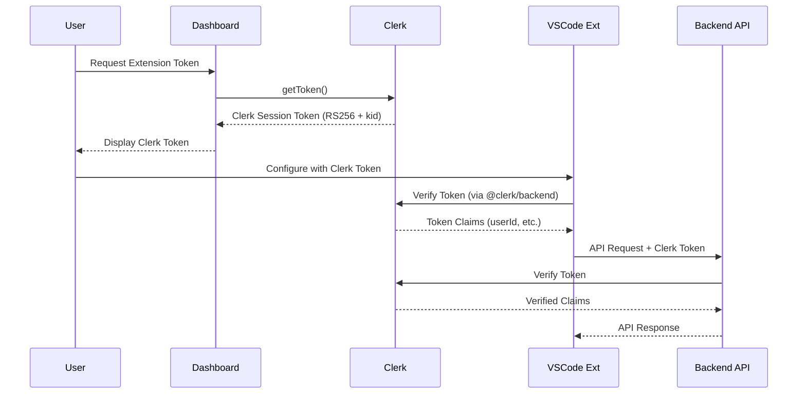

# VSCode Extension Clerk Token Authentication Solution

## Problem Summary

**Error**: `JWT header missing kid (key ID)` when VSCode extension tries to verify token

**Root Cause**: Token type mismatch
- **Current**: Dashboard generates custom HS256 JWT (no `kid` header)
- **Extension Expects**: Clerk RS256 token (with `kid` header)

## Solution Architecture: Direct Clerk Token Authentication

### Overview

Instead of generating a custom JWT, we'll pass Clerk session tokens directly to the VSCode extension for verification.



### Key Changes

#### 1. Dashboard Changes (Frontend)

**File**: [`src/pages/Dashboard.tsx`](src/pages/Dashboard.tsx)

**Current Behavior** (Lines 230-343):
```typescript
// Calls /api/dashboard-token/generate
const response = await fetch('/api/dashboard-token/generate', {
  method: 'POST',
  headers: {
    'Authorization': `Bearer ${clerkToken}`
  }
});
```

**New Behavior**:
```typescript
const generateToken = async () => {
  // Simply get and display the Clerk token directly
  const clerkToken = await getToken();
  setExtensionToken(clerkToken);
  
  toast({
    title: "Token Generated",
    description: "Clerk session token ready for VSCode extension",
  });
};
```

**Benefits**:
- ✅ No backend API call needed
- ✅ Uses Clerk's built-in RS256 + kid
- ✅ Secure verification via Clerk's public keys
- ✅ Simpler implementation

**Considerations**:
- ⚠️ Clerk tokens expire (default: 60 seconds for client, but configurable)
- ⚠️ Need token refresh mechanism in extension

#### 2. VSCode Extension Changes

**Required Package**: `@clerk/backend`

**Token Verification Logic**:
```typescript
import { verifyToken } from '@clerk/backend';

async function verifyExtensionToken(token: string) {
  try {
    const claims = await verifyToken(token, {
      secretKey: process.env.CLERK_SECRET_KEY
    });
    
    if (!claims.sub) {
      throw new Error('Invalid token: missing user ID');
    }
    
    return {
      userId: claims.sub,
      valid: true
    };
  } catch (error) {
    console.error('JWT verification failed:', error);
    return { valid: false, error: error.message };
  }
}
```

**Token Refresh Strategy**:
```typescript
// Option A: Prompt user to regenerate when expired
// Option B: Implement automatic refresh using Clerk SDK
// Option C: Use long-lived Clerk tokens (see Token Expiry section)
```

#### 3. Backend API Changes (Minimal)

**Files**: 
- [`backend-api-example/routes/vscode.js`](backend-api-example/routes/vscode.js)
- [`api/extension/auth/validate.ts`](api/extension/auth/validate.ts)

**Current**: Expects custom HS256 JWT
**New**: Expects and verifies Clerk RS256 token

```typescript
// Example update to validation endpoint
import { verifyToken } from '@clerk/backend';

export default async function handler(req: NextApiRequest, res: NextApiResponse) {
  const authHeader = req.headers.authorization;
  const token = authHeader?.substring(7);
  
  try {
    const claims = await verifyToken(token, {
      secretKey: process.env.CLERK_SECRET_KEY
    });
    
    return res.status(200).json({
      valid: true,
      userId: claims.sub
    });
  } catch (error) {
    return res.status(401).json({
      valid: false,
      error: 'Invalid Clerk token'
    });
  }
}
```

### Token Expiry Handling

#### Clerk Token Lifetimes

**Default Clerk Session Token**:
- Client-side: 60 seconds
- Server-side: Can be extended to hours

**Options for Extension**:

**Option 1: Long-Lived Clerk Tokens** (Recommended)
```typescript
// In Dashboard.tsx
const clerkToken = await getToken({ 
  template: 'vscode-extension',  // Custom template
  skipCache: true 
});
```

Configure in Clerk Dashboard:
1. Go to JWT Templates
2. Create "vscode-extension" template
3. Set token lifetime to 24 hours (or desired duration)
4. Include required claims: `sub`, `email`, etc.

**Option 2: Extension Auto-Refresh**
```typescript
// Extension periodically checks token expiry
setInterval(async () => {
  if (isTokenExpiringSoon()) {
    await promptUserToRefreshToken();
  }
}, 5 * 60 * 1000); // Check every 5 minutes
```

**Option 3: Refresh Token Flow** (Complex)
- Implement OAuth refresh token pattern
- Store refresh token securely
- Exchange for new access tokens automatically

### Security Considerations

✅ **Advantages of Clerk Tokens**:
- Industry-standard RS256 asymmetric encryption
- Public key verification (no secret sharing)
- Built-in expiry and revocation
- Clerk handles key rotation

⚠️ **Security Checklist**:
- [ ] Use HTTPS for all token transmission
- [ ] Never log full tokens (only first 10 chars)
- [ ] Store tokens securely in extension (VS Code SecretStorage)
- [ ] Implement token expiry checks
- [ ] Use long-lived tokens only for trusted environments
- [ ] Add rate limiting to token endpoints

### Migration Steps

#### Phase 1: Update Dashboard (Frontend)
1. ✅ Simplify token generation to return Clerk token directly
2. ✅ Update UI messaging (explain it's a Clerk token)
3. ✅ Add token expiry information to UI
4. ✅ Test token generation flow

#### Phase 2: Update VSCode Extension
1. ✅ Add `@clerk/backend` dependency
2. ✅ Replace JWT verification logic
3. ✅ Update configuration docs
4. ✅ Implement token expiry handling
5. ✅ Test with Clerk tokens

#### Phase 3: Update Backend APIs
1. ✅ Update validation endpoints to expect Clerk tokens
2. ✅ Remove custom JWT generation code (optional)
3. ✅ Update API documentation
4. ✅ Test all VSCode extension API calls

#### Phase 4: Documentation & Cleanup
1. ✅ Update extension setup guide
2. ✅ Document token refresh process
3. ✅ Remove old custom JWT generation endpoint
4. ✅ Update error messages

### Testing Strategy

#### Unit Tests
```typescript
// Test Clerk token verification
describe('Clerk Token Verification', () => {
  it('should verify valid Clerk token', async () => {
    const token = await getValidClerkToken();
    const result = await verifyExtensionToken(token);
    expect(result.valid).toBe(true);
  });
  
  it('should reject custom HS256 token', async () => {
    const token = generateCustomHS256Token();
    const result = await verifyExtensionToken(token);
    expect(result.valid).toBe(false);
    expect(result.error).toContain('kid');
  });
});
```

#### Integration Tests
1. ✅ Generate Clerk token in dashboard
2. ✅ Copy to VSCode extension
3. ✅ Make API request to backend
4. ✅ Verify successful authentication
5. ✅ Test token expiry and refresh

### File Changes Summary

| File | Change Type | Description |
|------|-------------|-------------|
| [`src/pages/Dashboard.tsx`](src/pages/Dashboard.tsx:230-343) | Modify | Simplify to return Clerk token directly |
| VSCode Extension (verification logic) | Modify | Use `@clerk/backend` for verification |
| [`backend-api-example/routes/vscode.js`](backend-api-example/routes/vscode.js) | Modify | Accept and verify Clerk tokens |
| [`api/extension/auth/validate.ts`](api/extension/auth/validate.ts) | Modify | Use Clerk token verification |
| [`api/dashboard-token/generate.ts`](api/dashboard-token/generate.ts) | Remove/Deprecate | No longer needed |
| Clerk Dashboard | Configure | Create long-lived JWT template |
| Extension Settings | Update | Document Clerk token usage |

### Rollback Plan

If issues arise:
1. Keep both endpoints active during transition
2. Add feature flag to toggle between custom JWT and Clerk token
3. Maintain backward compatibility for 1-2 versions
4. Provide clear migration guide for users

### Next Steps

1. **Immediate**: Review and approve this architecture
2. **Week 1**: Implement dashboard changes
3. **Week 1-2**: Update VSCode extension verification
4. **Week 2**: Update backend APIs
5. **Week 3**: Testing and documentation
6. **Week 4**: Production deployment

### Environment Variables Required

```bash
# Clerk Configuration (already exists)
CLERK_SECRET_KEY=sk_test_...
CLERK_PUBLISHABLE_KEY=pk_test_...

# Optional: Custom JWT template name
CLERK_VSCODE_TEMPLATE=vscode-extension
```

### FAQ

**Q: Will this break existing users?**
A: Yes, temporarily. They'll need to regenerate tokens. Consider a deprecation period.

**Q: What about offline usage?**
A: Clerk tokens require internet for verification. Consider caching verified claims.

**Q: Can we use both token types?**
A: Yes, maintain backward compatibility by checking token format before verification.

**Q: How to handle token revocation?**
A: Clerk automatically handles revoked tokens. Extension will receive 401 and prompt re-auth.

## Conclusion

This solution eliminates the JWT verification error by using Clerk's native RS256 tokens with `kid` headers. It's simpler, more secure, and aligns with industry standards.

**Estimated Implementation Time**: 1-2 weeks
**Risk Level**: Low (well-established pattern)
**User Impact**: Medium (requires token regeneration)