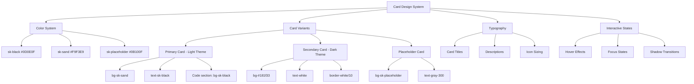

# Card Design System Specification

## Overview
This document defines a consistent card layout system for the Blue Byte Booster interface, ensuring uniform dimensions, styling, and visual cohesion across all components.

## Color System

### Primary Colors
```css
/* Add to tailwind.config.ts colors section */
'sk-black': '#0D0E0F',
'sk-sand': '#F9F3E9', 
'sk-placeholder': '#0B100F',
```

### CSS Utility Classes to Add
```css
/* Add to src/index.css */

/* Background colors */
.bg-sk-black {
  background-color: #0D0E0F;
}

.bg-sk-sand {
  background-color: #F9F3E9;
}

.bg-sk-placeholder {
  background-color: #0B100F;
}

/* Text colors */
.text-sk-black {
  color: #0D0E0F;
}

.text-sk-sand {
  color: #F9F3E9;
}

/* Text with opacity */
.text-sk-black\/50 {
  color: rgba(13, 14, 15, 0.5);
}

.text-sk-sand\/50 {
  color: rgba(249, 243, 233, 0.5);
}
```

## Card Variants

### 1. Primary Card (Light Theme)
**Usage**: Feature showcases, content cards
```tsx
<div className="bg-sk-sand rounded-lg shadow-lg border border-gray-200/20 p-6 min-h-[400px] transition-all duration-300 hover:shadow-xl hover:-translate-y-1">
  {/* Icon */}
  <div className="mb-4">
    <Icon className="w-6 h-6 text-sk-black" />
  </div>
  
  {/* Content */}
  <h3 className="text-xl font-semibold text-sk-black mb-3">{title}</h3>
  <p className="text-sm text-sk-black/70 mb-6">{description}</p>
  
  {/* Code/Demo Section */}
  <div className="bg-sk-black rounded-b-lg h-[250px] -mx-6 -mb-6 mt-auto">
    {/* Demo content */}
  </div>
</div>
```

### 2. Secondary Card (Dark Theme)
**Usage**: Feature cards in dark sections
```tsx
<div className="bg-[#181f33] rounded-2xl shadow-2xl border border-white/10 p-8 min-h-[370px] transition-all duration-300 hover:shadow-3xl hover:-translate-y-1">
  {/* Icon */}
  <div className="mb-8">
    <Icon className="w-24 h-24 bg-white/10 rounded-xl p-2" />
  </div>
  
  {/* Content */}
  <h3 className="text-2xl font-bold text-white mb-3">{title}</h3>
  <p className="text-base text-gray-300">{description}</p>
</div>
```

### 3. Placeholder Card
**Usage**: Empty states, loading states
```tsx
<div className="bg-sk-placeholder rounded-lg shadow-lg border border-gray-600/20 p-6 min-h-[400px] transition-all duration-300 hover:shadow-xl">
  {/* Content with light text for contrast */}
  <div className="flex items-center justify-center h-full">
    <span className="text-gray-300 text-sm">Placeholder Content</span>
  </div>
</div>
```

## Standardized Dimensions

### Card Sizes
- **Standard Height**: `min-h-[400px]` for primary cards
- **Feature Height**: `min-h-[370px]` for secondary cards
- **Code Demo Height**: `h-[250px]` for code sections
- **Icon Sizes**: 
  - Small: `w-6 h-6` (24px)
  - Large: `w-24 h-24` (96px)

### Spacing
- **Card Padding**: `p-6` (24px) for primary, `p-8` (32px) for secondary
- **Content Gaps**: `gap-4` (16px) between elements
- **Grid Gaps**: `gap-6` (24px) between cards

## Typography System

### Headings
```css
/* Primary card titles */
.card-title-primary {
  @apply text-xl font-semibold text-sk-black mb-3;
}

/* Secondary card titles */
.card-title-secondary {
  @apply text-2xl font-bold text-white mb-3;
}

/* Descriptions */
.card-description-primary {
  @apply text-sm text-sk-black/70 leading-relaxed;
}

.card-description-secondary {
  @apply text-base text-gray-300 leading-relaxed;
}
```

## Interactive States

### Hover Effects
```css
/* Standard card hover */
.card-hover {
  @apply transition-all duration-300 hover:shadow-xl hover:-translate-y-1;
}

/* Enhanced card hover */
.card-hover-enhanced {
  @apply transition-all duration-300 hover:shadow-3xl hover:-translate-y-1;
}
```

### Focus States
```css
/* Accessibility focus */
.card-focus {
  @apply focus:outline-none focus:ring-2 focus:ring-blue-500 focus:ring-offset-2;
}
```

## Shadow System

### Shadow Variants
```css
/* Light shadows for primary cards */
.shadow-card-light {
  box-shadow: 0 4px 12px rgba(0, 0, 0, 0.1);
}

/* Dark shadows for secondary cards */
.shadow-card-dark {
  box-shadow: 0 25px 50px -12px rgba(0, 0, 0, 0.5);
}

/* Enhanced hover shadows */
.shadow-card-hover {
  box-shadow: 0 20px 40px rgba(0, 0, 0, 0.15);
}
```

## Border System

### Border Variants
```css
/* Light theme borders */
.border-card-light {
  @apply border border-gray-200/20;
}

/* Dark theme borders */
.border-card-dark {
  @apply border border-white/10;
}

/* Placeholder borders */
.border-card-placeholder {
  @apply border border-gray-600/20;
}
```

## Accessibility Requirements

### Contrast Ratios
- **sk-sand (#F9F3E9) + sk-black (#0D0E0F)**: 15.8:1 (AAA)
- **sk-placeholder (#0B100F) + white text**: 18.5:1 (AAA)
- **Dark cards (#181f33) + white text**: 12.6:1 (AAA)

### ARIA Labels
```tsx
// Required attributes for cards
<div 
  role="article"
  aria-label={`Feature: ${title}`}
  tabIndex={0}
  className="card-focus"
>
```

## Implementation Checklist

### Files to Update
1. **tailwind.config.ts**: Add sk-black, sk-sand, sk-placeholder colors
2. **src/index.css**: Add utility classes and card styles
3. **src/components/ui/card.tsx**: Create standardized card variants
4. **src/components/FeatureShowcase.tsx**: Update to use new system
5. **src/components/LinterIntegrationCard.tsx**: Update to use new system
6. **src/components/FeatureShowcasePlaceholders.tsx**: Update to use new system
7. **src/components/Features.tsx**: Update to use new system

### Component Updates Required
- [ ] Replace all `bg-sk-*` classes with proper Tailwind utilities
- [ ] Standardize card dimensions across all components
- [ ] Apply consistent shadow and border treatments
- [ ] Ensure proper contrast ratios for all text
- [ ] Add proper ARIA labels and focus states
- [ ] Test responsive behavior across breakpoints

## Responsive Behavior

### Breakpoint Adjustments
```css
/* Mobile adjustments */
@media (max-width: 768px) {
  .card-responsive {
    @apply p-4 min-h-[350px];
  }
}

/* Tablet adjustments */
@media (min-width: 769px) and (max-width: 1024px) {
  .card-responsive {
    @apply p-6 min-h-[380px];
  }
}

/* Desktop */
@media (min-width: 1025px) {
  .card-responsive {
    @apply p-6 min-h-[400px];
  }
}
```

## Mermaid Diagram: Card System Architecture



This specification provides a complete foundation for implementing a consistent card design system across the entire interface.