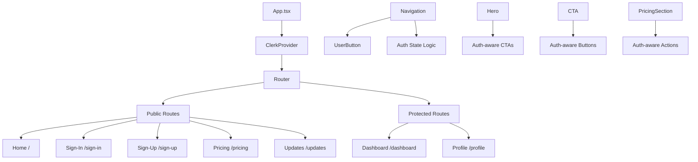

# Clerk Authentication Component Specifications

## Component Architecture Overview



## 1. Authentication Pages

### SignUp Page Component (`src/pages/SignUp.tsx`)

```typescript
interface SignUpPageProps {
  redirectUrl?: string;
  plan?: 'starter' | 'pro' | 'teams';
}

interface SignUpPageState {
  isLoading: boolean;
  error: string | null;
  plan: string | null;
}
```

**Features:**
- Custom Clerk SignUp component integration
- Plan selection from URL parameters
- Email verification flow
- Social login options (Google, GitHub)
- Terms of service acceptance
- Responsive design with glassmorphism effects
- Loading states and error handling
- SEO optimization

**Layout Structure:**
```
┌─────────────────────────────────────┐
│ Gradient Background                 │
│ ┌─────────────────────────────────┐ │
│ │ Logo + Tagline                  │ │
│ │                                 │ │
│ │ ┌─────────────────────────────┐ │ │
│ │ │ Sign-Up Form Card           │ │ │
│ │ │ - Email Input               │ │ │
│ │ │ - Password Input            │ │ │
│ │ │ - Confirm Password          │ │ │
│ │ │ - Terms Checkbox            │ │ │
│ │ │ - Sign Up Button            │ │ │
│ │ │ - Social Login Buttons      │ │ │
│ │ │ - Sign In Link              │ │ │
│ │ └─────────────────────────────┘ │ │
│ └─────────────────────────────────┘ │
└─────────────────────────────────────┘
```

### SignIn Page Component (`src/pages/SignIn.tsx`)

```typescript
interface SignInPageProps {
  redirectUrl?: string;
}

interface SignInPageState {
  isLoading: boolean;
  error: string | null;
  rememberMe: boolean;
}
```

**Features:**
- Custom Clerk SignIn component integration
- Remember me functionality
- Forgot password flow
- Social login options
- Link to sign-up page
- Responsive design matching sign-up page
- Loading states and error handling

### Dashboard Page Component (`src/pages/Dashboard.tsx`)

```typescript
interface DashboardProps {
  user: User;
}

interface DashboardState {
  isLoading: boolean;
  stats: UserStats;
  recentActivity: Activity[];
}

interface UserStats {
  totalRequests: number;
  remainingCredits: number;
  planType: string;
  nextBillingDate: string;
}
```

**Features:**
- Welcome message with user name
- Usage statistics dashboard
- Quick action buttons
- Recent activity feed
- Plan upgrade prompts
- Navigation to profile and settings

### Profile Page Component (`src/pages/Profile.tsx`)

```typescript
interface ProfilePageProps {
  user: User;
}
```

**Features:**
- Clerk UserProfile component integration
- Account settings management
- Security settings
- Billing information
- Connected accounts
- Delete account functionality

## 2. Authentication Components

### ProtectedRoute Component (`src/components/auth/ProtectedRoute.tsx`)

```typescript
interface ProtectedRouteProps {
  children: React.ReactNode;
  fallback?: React.ReactNode;
  requiredRole?: string;
  redirectTo?: string;
}
```

**Features:**
- Route protection based on authentication state
- Role-based access control
- Custom fallback components
- Automatic redirects for unauthenticated users
- Loading states during auth check

### AuthButton Component (`src/components/auth/AuthButton.tsx`)

```typescript
interface AuthButtonProps {
  variant: 'sign-in' | 'sign-up' | 'get-started';
  size?: 'sm' | 'md' | 'lg';
  className?: string;
  plan?: string;
  redirectUrl?: string;
}
```

**Features:**
- Reusable authentication button component
- Different variants for different contexts
- Plan parameter passing for pricing integration
- Custom redirect URL support
- Loading states and disabled states

### UserMenu Component (`src/components/auth/UserMenu.tsx`)

```typescript
interface UserMenuProps {
  user: User;
  variant: 'desktop' | 'mobile';
}
```

**Features:**
- User avatar and name display
- Dropdown menu with user actions
- Quick links to dashboard and profile
- Sign-out functionality
- Responsive design for desktop and mobile

## 3. Updated Existing Components

### Navigation Component Updates

**New Props:**
```typescript
interface NavigationProps {
  // Existing props remain the same
}

// New internal state
interface NavigationState {
  isScrolled: boolean;
  isMobileMenuOpen: boolean;
  showResources: boolean;
  user: User | null;
  isLoaded: boolean;
}
```

**Changes:**
- Replace user icon with Clerk UserButton
- Update "GET STARTED" button logic
- Add authentication state management
- Update mobile menu with user info
- Add sign-out functionality

### Hero Component Updates

**New Props:**
```typescript
interface HeroProps {
  // No new props needed
}
```

**Changes:**
- Update "Get Started" button to use AuthButton component
- Add authentication state awareness
- Implement conditional routing logic

### CTA Component Updates

**Changes:**
- Update "Start Free Trial" button to use AuthButton component
- Add authentication state awareness
- Implement conditional button text and actions

### PricingSection Component Updates

**New Props:**
```typescript
interface PricingSectionProps {
  // Existing props remain the same
}
```

**Changes:**
- Update all pricing buttons to use AuthButton component
- Add plan parameter passing
- Implement authentication-aware button states

## 4. Custom Hooks

### useAuth Hook (`src/hooks/useAuth.ts`)

```typescript
interface UseAuthReturn {
  user: User | null;
  isLoaded: boolean;
  isSignedIn: boolean;
  signOut: () => Promise<void>;
  redirectToSignIn: (redirectUrl?: string) => void;
  redirectToSignUp: (plan?: string) => void;
}

export const useAuth = (): UseAuthReturn => {
  // Implementation using Clerk hooks
};
```

### useRedirectAfterAuth Hook (`src/hooks/useRedirectAfterAuth.ts`)

```typescript
interface UseRedirectAfterAuthOptions {
  defaultRedirect?: string;
  preserveQuery?: boolean;
}

export const useRedirectAfterAuth = (
  options?: UseRedirectAfterAuthOptions
) => {
  // Implementation for handling post-auth redirects
};
```

### usePlanSelection Hook (`src/hooks/usePlanSelection.ts`)

```typescript
interface UsePlanSelectionReturn {
  selectedPlan: string | null;
  setSelectedPlan: (plan: string) => void;
  redirectToSignUpWithPlan: (plan: string) => void;
}

export const usePlanSelection = (): UsePlanSelectionReturn => {
  // Implementation for plan selection and URL parameter handling
};
```

## 5. TypeScript Types

### Authentication Types (`src/types/auth.ts`)

```typescript
import { User } from '@clerk/clerk-react';

export interface AuthUser extends User {
  planType?: string;
  credits?: number;
  lastLoginAt?: string;
}

export interface AuthState {
  isLoaded: boolean;
  isSignedIn: boolean;
  user: AuthUser | null;
}

export interface PlanType {
  id: 'starter' | 'pro' | 'teams' | 'enterprise';
  name: string;
  price: {
    monthly: number;
    yearly: number;
  };
  features: string[];
}

export interface UserStats {
  totalRequests: number;
  remainingCredits: number;
  planType: string;
  nextBillingDate: string;
  usageThisMonth: number;
}

export interface Activity {
  id: string;
  type: 'login' | 'request' | 'upgrade' | 'setting_change';
  description: string;
  timestamp: string;
  metadata?: Record<string, any>;
}
```

## 6. Styling and Theme Configuration

### Clerk Theme Configuration (`src/config/clerkTheme.ts`)

```typescript
import { dark } from '@clerk/themes';

export const clerkTheme = {
  baseTheme: dark,
  variables: {
    colorPrimary: '#3b82f6',
    colorBackground: '#0a0f1c',
    colorInputBackground: '#1a2332',
    colorInputText: '#ffffff',
    colorText: '#ffffff',
    colorTextSecondary: '#9ca3af',
    borderRadius: '0.5rem',
    fontFamily: 'Inter, system-ui, sans-serif',
  },
  elements: {
    card: 'bg-gradient-to-br from-slate-900 to-slate-800 border border-white/10',
    headerTitle: 'text-white text-2xl font-bold',
    headerSubtitle: 'text-gray-300',
    socialButtonsBlockButton: 'border border-white/20 hover:bg-white/10',
    formButtonPrimary: 'bg-blue-600 hover:bg-blue-700 text-white',
    footerActionLink: 'text-blue-400 hover:text-blue-300',
  },
};
```

### Custom CSS Classes (`src/styles/auth.css`)

```css
/* Authentication page specific styles */
.auth-page {
  @apply min-h-screen flex items-center justify-center;
  background: linear-gradient(135deg, #0a0f1c 0%, #1a2332 100%);
}

.auth-card {
  @apply bg-white/5 backdrop-blur-lg border border-white/10 rounded-2xl p-8 shadow-2xl;
  max-width: 400px;
  width: 100%;
}

.auth-logo {
  @apply flex items-center justify-center mb-8;
}

.auth-form {
  @apply space-y-6;
}

.auth-input {
  @apply w-full px-4 py-3 bg-white/10 border border-white/20 rounded-lg text-white placeholder-gray-400 focus:outline-none focus:ring-2 focus:ring-blue-500 focus:border-transparent;
}

.auth-button {
  @apply w-full bg-blue-600 hover:bg-blue-700 text-white font-medium py-3 px-4 rounded-lg transition-colors duration-200 focus:outline-none focus:ring-2 focus:ring-blue-500 focus:ring-offset-2 focus:ring-offset-gray-900;
}

.auth-social-button {
  @apply w-full border border-white/20 text-white hover:bg-white/10 font-medium py-3 px-4 rounded-lg transition-colors duration-200 flex items-center justify-center gap-2;
}

.auth-link {
  @apply text-blue-400 hover:text-blue-300 transition-colors duration-200;
}

.auth-divider {
  @apply flex items-center my-6;
}

.auth-divider::before,
.auth-divider::after {
  @apply flex-1 h-px bg-white/20;
  content: '';
}

.auth-divider span {
  @apply px-4 text-gray-400 text-sm;
}
```

## 7. Error Handling and Loading States

### Error Boundary Component (`src/components/auth/AuthErrorBoundary.tsx`)

```typescript
interface AuthErrorBoundaryProps {
  children: React.ReactNode;
  fallback?: React.ComponentType<{ error: Error }>;
}

interface AuthErrorBoundaryState {
  hasError: boolean;
  error: Error | null;
}
```

### Loading Components

**AuthPageSkeleton** (`src/components/auth/AuthPageSkeleton.tsx`)
- Skeleton loader for authentication pages
- Matches the layout of sign-in/sign-up forms
- Smooth loading transitions

**UserMenuSkeleton** (`src/components/auth/UserMenuSkeleton.tsx`)
- Skeleton loader for user menu
- Shows during authentication state loading
- Maintains layout stability

## 8. SEO and Meta Tags

### Meta Tag Configuration (`src/utils/seo.ts`)

```typescript
interface PageMeta {
  title: string;
  description: string;
  ogTitle?: string;
  ogDescription?: string;
  canonical?: string;
}

export const authPageMeta: Record<string, PageMeta> = {
  signUp: {
    title: 'Sign Up - Softcodes | AI Coding Copilot',
    description: 'Create your Softcodes account and start coding faster with our AI copilot. Free trial available.',
    ogTitle: 'Sign Up for Softcodes',
    ogDescription: 'Join thousands of developers using Softcodes AI copilot',
  },
  signIn: {
    title: 'Sign In - Softcodes | AI Coding Copilot',
    description: 'Sign in to your Softcodes account and continue coding with AI assistance.',
    ogTitle: 'Sign In to Softcodes',
    ogDescription: 'Access your Softcodes AI copilot dashboard',
  },
  dashboard: {
    title: 'Dashboard - Softcodes',
    description: 'Your Softcodes dashboard with usage statistics and account management.',
  },
  profile: {
    title: 'Profile - Softcodes',
    description: 'Manage your Softcodes account settings and preferences.',
  },
};
```

## 9. Testing Specifications

### Unit Tests
- Authentication hook tests
- Component rendering tests
- Error handling tests
- Redirect logic tests

### Integration Tests
- Authentication flow tests
- Protected route tests
- User state management tests

### E2E Tests
- Complete sign-up flow
- Complete sign-in flow
- Protected route access
- Sign-out functionality

This comprehensive specification provides detailed implementation guidance for all authentication-related components and ensures consistent integration with the existing design system and user experience.