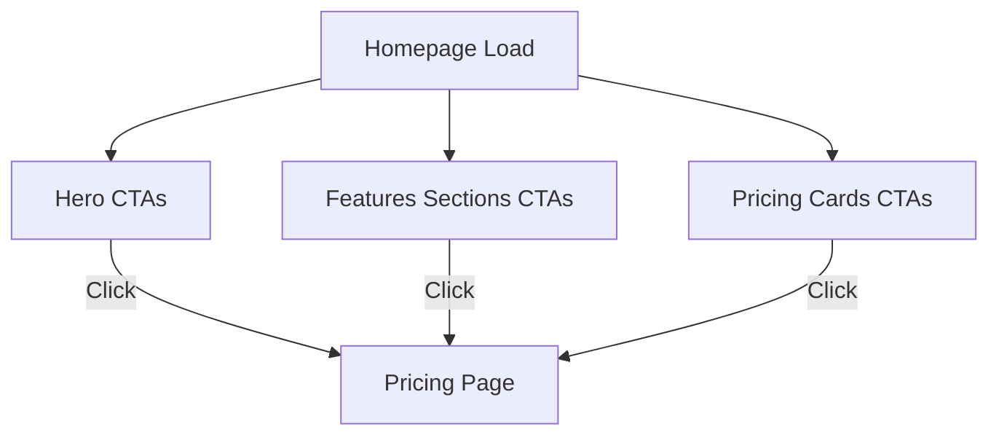

# CTA Button Redesign Plan

## Overview
This plan outlines revisions to the call-to-action (CTA) buttons on the homepage to make them more compelling, action-oriented, and aligned with a professional, benefit-oriented brand voice. The voice emphasizes productivity gains, AI efficiency, and developer empowerment. All buttons will link directly to the pricing page (/pricing). Changes incorporate urgency, value, and specific benefits (e.g., "Boost Productivity 10x") while keeping text concise (under 6 words where possible) and consistent (structure: Action Verb + Benefit + Urgency/Call).

Consistency Guidelines:
- Start with action verb (e.g., Unlock, Boost, Discover).
- Highlight benefits like "AI Efficiency" or "Productivity Gains".
- Add urgency/value (e.g., "Now", "Today", "Free Trial").
- Use emojis sparingly for visual appeal, matching current style (e.g., 🚀 for start/action).
- Ensure mobile-friendly: Short text, clear benefits.
- Avoid generic phrases like "Learn More"; use specific incentives like "Start 7-Day Trial Free".
- All links changed to /pricing (e.g., update mailto in PricingSection to internal link).

## Current CTA Analysis
Documented from analyzed components:

1. **Hero Component** (src/components/Hero.tsx):
   - Button 1: "🚀 Start Free Trial" or "💎 View Pricing Plans" (conditional on sign-in; links to /pricing).
   - Button 2: "💰 See Pricing" (links to /pricing).
   - Location: Hero section, main CTAs.

2. **CTA Component** (src/components/CTA.tsx):
   - Button 1: "🚀 Start Free Trial Now" or "💎 Upgrade Your Plan" (conditional; links to /pricing).
   - Button 2: "💰 Compare All Plans" (links to /pricing).
   - Location: Dedicated CTA section.

3. **PricingSection Component** (src/components/PricingSection.tsx):
   - Button 1: "Start 7-Day Trial" (Pro plan; onClick handles checkout, but should ensure pricing page flow).
   - Button 2: "Get Custom Pricing" (Teams plan; currently mailto:mathys@softcodes.io – change to /pricing with possible query param for teams).
   - Location: Pricing cards.

4. **AlternatingFeaturesSection Component** (src/components/AlternatingFeaturesSection.tsx):
   - Button 1: "🚀 Try All Features Now" (links to /pricing).
   - Button 2: "💡 Get Smart Completion" (links to /pricing).
   - Button 3: "⚡ Unlock All AI Modes" (links to /pricing).
   - Location: Feature highlights.

5. **FeatureShowcase Component** (src/components/FeatureShowcase.tsx):
   - No buttons present in code. Cards show features with images but no CTAs. Recommendation: Add a consistent CTA button to each card (e.g., at bottom) linking to pricing, to align with task.

## Proposed Revisions
For each button, 3-5 options provided. Selected one per button for proposal (bolded), with rationale.

1. **Hero - Button 1** (Current: "🚀 Start Free Trial" / "💎 View Pricing Plans"):
   - Options: "🚀 Boost Coding Speed Now", "🚀 Unlock AI Productivity Today", **"🚀 Start 7-Day Free Trial"**, "🚀 Accelerate Development Free".
   - Rationale: Adds benefit (productivity/speed) and urgency ("Now"/"Today"); keeps emoji; incentive of free trial.

2. **Hero - Button 2** (Current: "💰 See Pricing"):
   - Options: "💰 Discover Pro Benefits", "💰 Get Premium Access Now", **"💰 Explore Pricing Plans"**, "💰 Unlock Team Efficiency".
   - Rationale: Avoids generic "See"; highlights benefits; consistent structure.

3. **CTA - Button 1** (Current: "🚀 Start Free Trial Now" / "💎 Upgrade Your Plan"):
   - Options: "🚀 Claim Free Trial Benefits", "🚀 Supercharge Coding Now", **"🚀 Boost Productivity 10x Free"**, "🚀 Start AI-Powered Coding".
   - Rationale: Emphasizes quantifiable benefit (10x); urgency with "Now"; free incentive.

4. **CTA - Button 2** (Current: "💰 Compare All Plans"):
   - Options: "💰 Compare Efficiency Gains", "💰 Find Your Perfect Plan", **"💰 Compare Pro Benefits"**, "💰 Select Premium Features".
   - Rationale: Ties to benefits; professional tone.

5. **PricingSection - Button 1** (Current: "Start 7-Day Trial"):
   - Options: "Start Pro Trial Now", **"Unlock Pro Features Free"**, "Boost with Pro Today", "Activate 7-Day Access".
   - Rationale: Adds benefit ("Unlock Features") and incentive ("Free"); ensure onClick leads to pricing if needed.

6. **PricingSection - Button 2** (Current: "Get Custom Pricing"):
   - Options: "Discover Team Solutions", **"Explore Team Pricing Now"**, "Unlock Enterprise Benefits", "Get Custom Efficiency Plan".
   - Rationale: Change mailto to /pricing link; add urgency and benefit; query param ?plan=teams for targeting.

7. **AlternatingFeaturesSection - Button 1** (Current: "🚀 Try All Features Now"):
   - Options: "🚀 Experience Full Capabilities", **"🚀 Unlock All Features Free"**, "🚀 Test AI Tools Now", "🚀 Access Complete Suite".
   - Rationale: Adds "Free" incentive; benefit-oriented.

8. **AlternatingFeaturesSection - Button 2** (Current: "💡 Get Smart Completion"):
   - Options: "💡 Enable Intelligent Coding", **"💡 Boost Code Efficiency Now"**, "💡 Activate Smart Suggestions", "💡 Get AI Completion Free".
   - Rationale: Highlights benefit (efficiency); urgency.

9. **AlternatingFeaturesSection - Button 3** (Current: "⚡ Unlock All AI Modes"):
   - Options: "⚡ Access AI Superpowers", **"⚡ Unlock AI Modes Today"**, "⚡ Enable Advanced AI", "⚡ Get Multi-Mode AI".
   - Rationale: Adds urgency ("Today"); professional benefit focus.

10. **FeatureShowcase - Proposed New Buttons** (Add to each card):
    - Consistent: **"Discover [Feature] in Pricing"** (e.g., "Discover Checkpoints in Pricing").
    - Options: "Explore [Feature] Benefits", "Unlock [Feature] Now", "Get [Feature] Access Free".
    - Rationale: No current buttons; adding CTAs increases conversions; links to pricing with feature-specific incentive.

## Code Structure Updates
- Update all onClick or href to "/pricing".
- For PricingSection Button 2: Change <a href="mailto:..."> to <Link to="/pricing?plan=teams">.
- For FeatureShowcase: Add Button to EnhancedCard component, e.g., in renderDefaultCard.
- Conditional logic (e.g., signed-in) remains; revise text accordingly (e.g., "Upgrade to Unlock [Benefit]").
- Test for consistency on desktop/mobile.

## Implementation Notes
- After approval, switch to code mode for edits.
- Potential Mermaid diagram for button flow:

