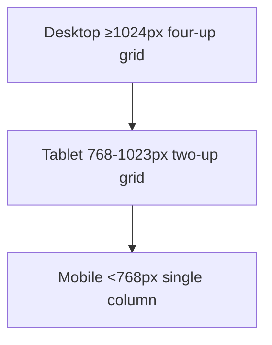

# Softcodes Homepage "Momentum" Marketing Section Specification

## 1. Section Purpose & Narrative Alignment  
- **Placement context:** Renders immediately beneath the hero contained within [`Hero.tsx`](src/components/Hero.tsx:20), inheriting the dark gradient ambiance generated by [`GradientBackground.tsx`](src/components/GradientBackground.tsx:10).  
- **Strategic intent:** Reinforce the hero promise by illustrating how Softcodes converts intent into delivery across the full engineering lifecycle before users reach feature deep-dives.  
- **Narrative framing:** Introduce the section with a concise framing sentence that bridges the hero’s “future of coding” promise to real outcomes, then present four narrative panels synchronized with the reference layout themes.  

| Reference Panel | Softcodes Messaging Hook | Core Narrative | CTA/Signal |
| --- | --- | --- | --- |
| **Accelerate Delivery** | “Ship faster with AI-native workflows” | Showcase Softcodes’ ability to unblock PRs, generate implementation-ready code, and maintain flow | Primary CTA (button) leading to Sign Up |
| **Protect Quality** | “Quality and compliance without slowing velocity” | Highlight lint-loop protections, SOC2 posture, and built-in safeguards ([`EnhancedCard`](src/components/ui/enhanced-card.tsx:11)) | Secondary text link to compliance page |
| **Scale Collaboration** | “Teams stay aligned across editors and branches” | Explain multiplayer context, session memory, shared playbooks | Visual cue with avatars from [`avatar.tsx`](src/components/ui/avatar.tsx:6) |
| **Enterprise-Ready** | “Meets enterprise rigor from day zero” | Emphasize SSO, advanced analytics, dedicated support | Status pill/badge using [`badge.tsx`](src/components/ui/badge.tsx:6) |

## 2. Structural Layout & Grid Behavior  

### 2.1 Section Skeleton
- **Root:** `<section>` with `id="momentum"` appended directly after `Hero`.
- **Container:** Reuse Tailwind container utility configured in [`tailwind.config.ts`](tailwind.config.ts:13) with `padding: 2rem` and `max-width: 1400px` at ≥2xl.
- **Internal structure:**  
  ```
  section#momentum
    div.container.mx-auto
      div.section-header (stacked copy)
      div.panel-grid (four cards)
  ```

### 2.2 Grid by Breakpoint
| Breakpoint | Layout | Column Behavior | Alignment | Gap Tokens |
| --- | --- | --- | --- | --- |
| ≥1280px (lg+) | 12-column CSS grid | Panels span 3 columns each (4-up). Header spans 8 columns centered. | Header center-aligned; cards baseline aligned with equal height. | `gap-x-8 gap-y-10` |
| 1024–1279px (md) | 8-column grid | Header spans full width; cards stack two per row (span 4 columns). | Cards align start; maintain equal heights with `min-h`. | `gap-x-6 gap-y-8` |
| 768–1023px (sm) | 2-column grid/flex hybrid | Header remains full-width; cards stack two per row, order preserved. | Center header text; cards full-width within column. | `gap-y-8` |
| <768px (xs) | Vertical flex stack | Header above cards; cards full width stacked with preserved narrative order. | Left-align body text for readability. | `space-y-6` |

- **Ordering rules:** Maintain panel order 1→4 across all viewports; no reordering on mobile to preserve narrative continuity.
- **Alignment fallback:** Use `place-items-stretch` to ensure matching card heights while allowing content-driven growth.

## 3. Content Inventory & Hierarchy  

### 3.1 Header Block
- **Eyebrow badge:** Inline pill (Badge component, `variant="outline"`) reading “Why teams choose Softcodes”.
- **H1-equivalent (Section title):** `text-4xl md:text-5xl` weight 700, e.g., “Momentum for every software team”.
- **Subcopy:** `text-xl text-muted-foreground` limited to ~80 characters per line, referencing hybrid AI + human workflow.
- **Supporting microcopy:** Optional `text-sm` line referencing existing customers/metrics.

### 3.2 Panels
Each panel leverages [`EnhancedCard`](src/components/ui/enhanced-card.tsx:11) `variant="primary"` by default, with `feature` sizing. Content order: icon badge → title (h3) → body copy → supporting element.

| Panel | Heading | Body Copy Focus | Supporting Elements |
| --- | --- | --- | --- |
| Accelerate Delivery | “Accelerate Delivery” | Stress auto-complete + PR-ready context | Primary CTA: [`Button`](src/components/ui/button.tsx:7) `variant="default"` labeled “Start building now” |
| Protect Quality | “Protect Quality” | SOC2, lint loops, test harness | Inline badge `variant="secondary"` labeled “SOC 2 Type II” |
| Scale Collaboration | “Scale Collaboration” | Shared context, team spaces | Avatar group using [`Avatar`](src/components/ui/avatar.tsx:6) with 3 sample team images |
| Enterprise-Ready | “Enterprise-Ready” | SSO, analytics, support tiers | Outline CTA link “Talk to sales”, optional supporting list of assurances |

### 3.3 Additional Elements
- **Iconography:** Lucide icons sized `w-10 h-10`, applied within `EnhancedCardIcon`.
- **Secondary CTA strip (optional):** Row of two buttons below grid: “Compare plans” (outline) and “Contact sales” (ghost).
- **Status pills:** Badges to call out compliance or uptime stats, e.g., `theme: default` or `secondary`.

## 4. Visual Styling & Design Tokens  

### 4.1 Background & Layers
- **Section background:** `bg-[#0F1629]` gradient overlay similar to Feature Showcase ([`features-showcase-specification.md`](features-showcase-specification.md:77)).
- **Top fade:** Add subtle top gradient (sand-to-transparent) to blend with hero.
- **Container background:** Transparent to keep hero-to-section continuity.

### 4.2 Card Treatments
- Base from [`EnhancedCard`](src/components/ui/enhanced-card.tsx:11): `rounded-lg`, `border-card-light`, `shadow-card-light`.
- **Hover:** Use `.card-hover` behavior defined in [`src/index.css`](src/index.css:499) to lift 4px with shadow escalate.
- **Enterprise panel variant:** Optionally switch to `variant="secondary"` for dark card to accent difference.

### 4.3 Typography
- Fonts follow global tokens in [`src/index.css`](src/index.css:12).
- Headings: use `font-bold`, track tightness same as hero `tracking-tight`.
- Body: `text-base text-muted-foreground`.

### 4.4 Spacing Tokens
- Section padding: `py-24 md:py-28` (96–112px).  
- Header bottom margin: `mb-16 md:mb-20`.  
- Card internal padding: inherit `p-8` from `feature` size.

### 4.5 Dividers & Accents
- Optional `border-t border-white/5` at top of section to separate hero.
- Icon badge background: `bg-primary/10` for light cards, `bg-white/10` for dark variant.

### 4.6 Brand Colors
- Primary tokens from [`design-system-colors.md`](design-system-colors.md:67) (sand/black palette).
- Ensure text contrast > 4.5:1; for sand cards use `text-sk-black`.

## 5. Interaction & Accessibility Guidelines  
- **Focus states:** Use built-in `.focus-visible` from button and `.card-focus` from [`src/index.css`](src/index.css:520); ensure cards are `tabIndex=0`.  
- **Keyboard navigation:** Cards in grid should be focusable articles; `aria-label` describing key benefit.  
- **CTAs:** Buttons use semantic `<button>` from [`button.tsx`](src/components/ui/button.tsx:44); secondary links as `<a>` with `aria-label`.  
- **Badges/avatars:** Provide `aria-hidden="true"` for decorative icons; avatars require alternative text if representing real people.  
- **Semantics:**  
  - `<section aria-labelledby="momentum-heading">`  
  - H2 for main section title, H3 for each panel.  
- **Contrast testing:** Validate 4.5:1 minimum per WCAG.  
- **Animations:** Keep hover transitions under 200ms; respect reduced motion (no mandatory animations beyond existing `.card-hover`).

## 6. Responsive Behavior & Panel Reflow  



- Maintain equal card heights using `min-h` values, but allow content wrap on mobile.
- Avatars scale from `h-10 w-10` to `h-8 w-8` on mobile.
- CTA row converts to stacked buttons with `space-y-3` at <640px.

## 7. Integration Notes  
- **Hero handoff:** Apply `mt-[-6rem]` negative margin to overlap top gradient if design requires, otherwise standard stacking with `pt-20` offset to respect hero `mb-16`.  
- **Container reuse:** Use `.container` class to align with navigation/hero width.  
- **Next section transition:** Provide bottom padding `pb-24` and optional subtle divider to lead into `<section id="features">`.  
- **Theming:** Respect `.scrolled` class behavior from [`src/index.css`](src/index.css:111) (ensures sand cards adapt when navbar flips to light mode).

## 8. Asset Requirements  
- **Icons:** Lucide pack (already imported elsewhere). Use consistent stroke weight 1.5px.  
- **Avatars:** Source from existing CDN assets or placeholder silhouettes; ensure 3 unique images.  
- **Badge/Status:** Reuse components (no new assets).  
- **Background shapes:** Optional blurred circles leveraging existing gradient motif (reuse CSS from [`GradientBackground.tsx`](src/components/GradientBackground.tsx:13)).

## 9. Acceptance Criteria  
- Section renders immediately after hero with continuous background blend.  
- Four panels display correct narrative order and responsive layout per table above.  
- Typography and color tokens match design system guidelines (`--primary`, sand/black palette).  
- Keyboard and screen reader users can reach and understand all interactive elements.  
- Hover/focus states match design language (lifted cards, outlined buttons).  
- CTA wiring: primary button navigates to `/sign-up`, enterprise link routes to sales/contact.  
- Spacing respects defined tokens with no visual collisions at any viewport.  
- No additional assets beyond outlined requirements; icons rendered vectorially.  
- QA can validate against this spec plus references for card/badge/button behavior.
