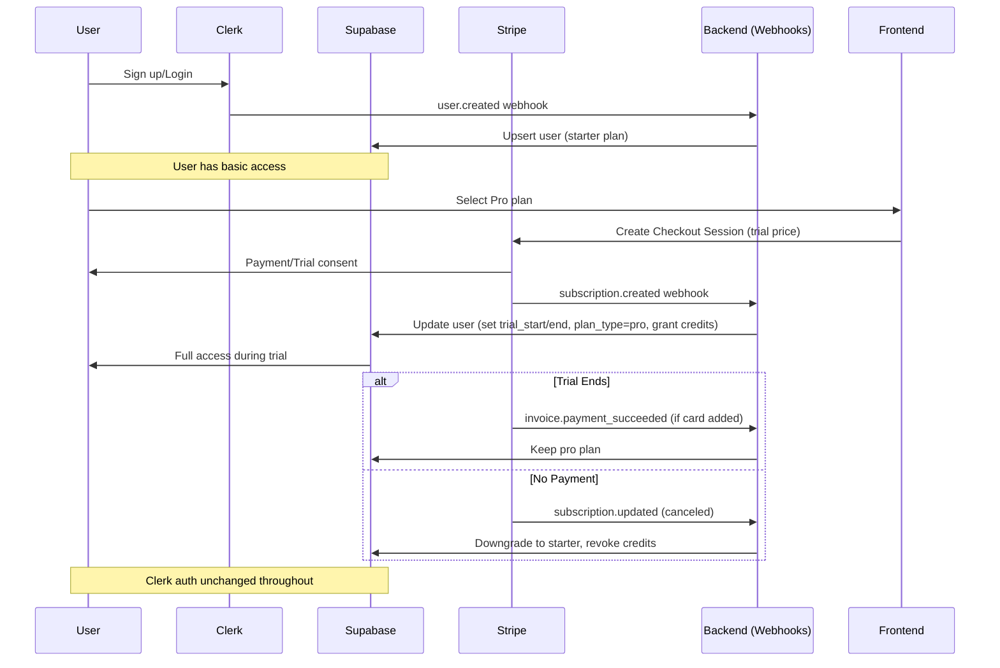

# Stripe Trial Period Integration with Supabase and Clerk

## Overview
This document explains how to implement trial periods for plans (Pro/Teams) using Stripe's dashboard features, and confirms compatibility with the existing Supabase database and Clerk authentication setup. The integration leverages Stripe's built-in `trial_period_days` on price objects, synced via webhooks to update user records in Supabase. Clerk handles user authentication and creation, while Supabase stores plan/trial state for access control.

## Current Integration Summary
- **Clerk**: Manages user auth (sign-up, login, profile updates). Webhooks (`user.created`, `user.updated`) sync user data (email, name, avatar) to Supabase `users` table via `upsert_user` function. No direct billing involvement—Clerk sessions are used for auth checks.
- **Stripe**: Handles subscriptions via price IDs (e.g., `price_1RvK8KH6gWxKcaTXO4AlW0MQ` for Pro monthly). Checkout sessions created in `src/utils/stripe/checkout.ts`. Subscriptions tied to Supabase `users` via `stripe_customer_id` and `subscription_id`.
- **Supabase**: Stores user plan state (`plan_type`, `credits`, `trial_start`, `trial_end`). Recent migration (`20251109_add_trial_columns.sql`) adds `trial_start` and `trial_end` columns to `users`. RLS policies enforce access based on plan/trial status. Clerk webhooks ensure user records exist before billing.

## Compatibility Assessment
Yes, Stripe dashboard trials will work correctly with Supabase and Clerk, with minimal code changes. Here's why:

### 1. Stripe Trial Mechanics
- In Stripe Dashboard: Edit a price (e.g., Pro monthly) > Add "Trial period" > Set days (e.g., 14). This adds `trial_period_days` to the Price object.
- On subscription creation: Stripe automatically starts a trial, setting `subscription.trial_start` and `subscription.trial_end`. No immediate charge; billing begins post-trial unless canceled.
- Supports both Pro (individual) and Teams (seats-based) plans. For Teams, trials apply per subscription, prorated on seat changes.
- No card required upfront (configurable in dashboard). Users can add card during trial via customer portal.

### 2. Integration with Clerk
- **User Flow**: User signs up via Clerk → Webhook creates/updates Supabase `users` record (plan_type='starter' initially).
- **Upgrade to Trial**: User selects plan in UI → Redirect to Stripe Checkout (with trial-enabled price) → Clerk session remains active; post-checkout webhook updates Supabase.
- **No Conflicts**: Clerk doesn't manage billing—it's purely auth. Trial access checked server-side via Supabase queries (e.g., `is_trial_active()` function using `trial_end > NOW()`).
- **Edge Cases**: If user deletes Clerk account during trial, webhook handles `user.deleted` to soft-delete Supabase record and cancel Stripe subscription.

### 3. Integration with Supabase
- **Database Sync**: Use Stripe webhooks (`customer.subscription.created`, `customer.subscription.updated`, `invoice.payment_succeeded`) to update `users`:
  - On trial start: Set `plan_type='pro'`, `trial_start=NOW()`, `trial_end=subscription.trial_end`, grant trial credits (e.g., 500 via `grant_credits` function).
  - Post-trial: If active, charge card and keep plan; if failed/canceled, downgrade to 'starter', revoke credits.
  - Existing columns (`trial_start`, `trial_end`) support this—no further schema changes needed unless tracking trial usage separately.
- **Access Control**: Update RLS policies and queries (e.g., in `src/api/stripe.ts`) to check `trial_end > NOW() OR plan_type != 'starter'`. Clerk JWTs can include user ID for Supabase auth.
- **Credit Management**: During trial, treat as full plan (full credits/features). Post-trial downgrade: Reset credits to starter (25), via webhook-triggered function.
- **Multi-Currency/Seats**: Trials work with EUR pricing; for Teams, trial on base subscription, seats added post-trial.

### Potential Issues & Mitigations
- **Trial Extension/Cancellation**: Handle via Stripe dashboard or customer portal. Webhook on `subscription.updated` syncs changes to Supabase.
- **Proration**: Stripe handles automatically; ensure backend calculates credits accordingly.
- **Downgrade Automation**: Implement cron job or Stripe `invoice.upcoming` webhook to notify/warn users 3 days before trial end.
- **Testing**: Use Stripe test mode (toggle in dashboard). Simulate trials with `trial_period_days=1` for quick tests.
- **Compliance**: Trials count toward Stripe limits; ensure terms disclose auto-billing post-trial.

## Implementation Steps
1. **Stripe Dashboard Setup**:
   - Go to Products > Prices > Edit Pro/Teams prices.
   - Enable trial (e.g., 14 days for Pro, 30 for Teams).
   - Save—Price ID remains same, but metadata/trial fields update.

2. **Backend Webhook Enhancements** (in `backend-api-example/routes/stripe-webhooks.js` or similar):
   - Listen for `customer.subscription.created/updated`.
   - Extract `trial_start`/`trial_end` from payload.
   - Update Supabase: `UPDATE users SET trial_start = ..., trial_end = ..., plan_type = 'pro' WHERE stripe_customer_id = ...`.
   - Call `grant_credits` for trial allocation.

3. **Frontend Updates** (Pricing/Dashboard pages):
   - Show "14-day free trial" badge on plans.
   - In Dashboard: Display trial countdown if active (query Supabase for `trial_end`).
   - Post-trial: Prompt upgrade/downgrade notice.

4. **Clerk Flow Integration**:
   - On signup (post-Clerk webhook): Set initial `plan_type='starter'`.
   - Upgrade button → Stripe Checkout with trial price → Webhook syncs trial to Supabase.

5. **Testing**:
   - Local: Use ngrok for webhooks, Stripe CLI for testing.
   - Verify: Signup → Upgrade to trial → Access features → Wait/simulate end → Downgrade.
   - Check: Supabase records update correctly; Clerk sessions unaffected.

## Diagram: Trial Flow

This setup ensures seamless trials without disrupting Clerk-Supabase sync. Total effort: Low (mostly config + webhook tweaks).