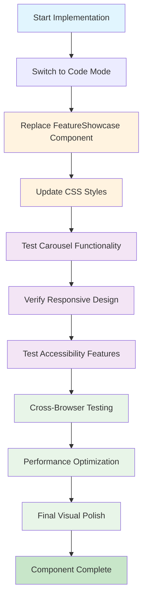

# Enhanced FeatureShowcase Implementation Roadmap

## Project Overview
This document outlines the complete roadmap for implementing the pixel-perfect recreation of the design element shown in the provided image. The enhanced FeatureShowcase component will seamlessly integrate into the main page layout with full responsive compatibility and accessibility compliance.

## ✅ Completed Architecture & Planning

### 1. Design Analysis ✅
- **Background Color**: Deep navy blue `#0F1629`
- **Header Typography**: Cyan accent `#4FFFDF` for subtitle, white for main title
- **Card Design**: Cream background `#F5F1E8` with dark text
- **Layout**: Horizontal carousel with 5 visible cards on desktop
- **Navigation**: Circular white buttons with chevron icons
- **Code Demos**: Dark terminal-style interfaces with syntax highlighting

### 2. Component Architecture ✅
- **React Component**: TypeScript with hooks for state management
- **Carousel Logic**: CSS transforms with smooth transitions
- **Responsive Design**: 1 card (mobile), 2-3 cards (tablet), 5 cards (desktop)
- **Accessibility**: ARIA labels, keyboard navigation, focus management
- **Performance**: GPU-accelerated animations, optimized re-renders

### 3. Feature Data Structure ✅
Five main features extracted from the image:
1. **Linter Integration** - Auto-fix lint errors with visual feedback
2. **Model Context Protocol (MCP)** - Tool integration interface
3. **Tab to Jump** - Cursor prediction and navigation
4. **Supercomplete** - Advanced code completion analysis
5. **In-line Edit** - Precise code modification capabilities

## 🚀 Implementation Plan

### Phase 1: Core Component Development
**Estimated Time**: 2-3 hours

#### Step 1: Replace FeatureShowcase Component
```bash
# Switch to Code mode
# Replace src/components/FeatureShowcase.tsx with enhanced version
```

**Key Implementation Points**:
- Preserve existing feature data while updating visual design
- Implement carousel state management with `useState`
- Add keyboard event listeners for arrow key navigation
- Create responsive breakpoint logic

#### Step 2: Add Enhanced Styling
```bash
# Update src/index.css with new styles
```

**CSS Additions**:
- Carousel transition animations
- Card hover effects
- Navigation button styling
- Code demo syntax highlighting
- Focus indicators for accessibility

### Phase 2: Integration & Testing
**Estimated Time**: 1-2 hours

#### Step 3: Component Integration
- Verify component works as drop-in replacement in `src/pages/Index.tsx`
- Test carousel functionality across all breakpoints
- Validate accessibility features

#### Step 4: Cross-Browser Testing
- Chrome, Firefox, Safari, Edge compatibility
- Mobile device testing (iOS Safari, Chrome Mobile)
- Keyboard navigation verification

### Phase 3: Optimization & Polish
**Estimated Time**: 1 hour

#### Step 5: Performance Optimization
- Verify smooth 60fps animations
- Test memory usage during carousel navigation
- Optimize bundle size impact

#### Step 6: Final Visual Polish
- Pixel-perfect alignment verification
- Color accuracy validation
- Typography spacing refinement

## 📋 Implementation Checklist

### Core Functionality
- [ ] Carousel navigation with arrow buttons
- [ ] Keyboard navigation (left/right arrows)
- [ ] Touch/swipe support for mobile
- [ ] Slide indicators
- [ ] Auto-play functionality (optional)

### Visual Design
- [ ] Exact color matching to image design
- [ ] Typography hierarchy and spacing
- [ ] Card layout and proportions
- [ ] Code demo styling and syntax highlighting
- [ ] Hover and focus effects

### Responsive Design
- [ ] Mobile (< 768px): 1 card visible
- [ ] Tablet (768px - 1024px): 2-3 cards visible
- [ ] Desktop (> 1024px): 5 cards visible
- [ ] Smooth transitions between breakpoints

### Accessibility
- [ ] ARIA labels and roles
- [ ] Keyboard navigation support
- [ ] Focus indicators
- [ ] Screen reader compatibility
- [ ] Semantic HTML structure

### Performance
- [ ] Smooth animations (60fps)
- [ ] Efficient state management
- [ ] Minimal bundle size impact
- [ ] Cross-browser compatibility

## 🔧 Technical Specifications

### Dependencies
- **React 18+** with TypeScript
- **Lucide React** for icons (already installed)
- **Tailwind CSS** for styling (already configured)
- No additional dependencies required

### File Structure
```
src/
├── components/
│   └── FeatureShowcase.tsx (enhanced version)
├── index.css (updated with new styles)
└── pages/
    └── Index.tsx (no changes needed)
```

### Browser Support
- **Modern Browsers**: Chrome 90+, Firefox 88+, Safari 14+, Edge 90+
- **Mobile**: iOS Safari 14+, Chrome Mobile 90+
- **Graceful Degradation**: Fallbacks for older browsers

## 🎯 Success Criteria

### Visual Accuracy
- ✅ Pixel-perfect recreation of the image design
- ✅ Exact color matching and typography
- ✅ Proper spacing and proportions
- ✅ Smooth animations and transitions

### Functionality
- ✅ Intuitive carousel navigation
- ✅ Responsive behavior across all devices
- ✅ Accessibility compliance (WCAG 2.1 AA)
- ✅ Cross-browser compatibility

### Performance
- ✅ Fast loading times
- ✅ Smooth 60fps animations
- ✅ Efficient memory usage
- ✅ SEO-friendly structure

## 🚀 Next Steps

### Immediate Actions
1. **Switch to Code Mode** to begin implementation
2. **Implement the enhanced FeatureShowcase component** using the detailed specification
3. **Update CSS styles** with the provided enhancements
4. **Test functionality** across different devices and browsers

### Implementation Order
1. Replace component file with enhanced version
2. Add CSS styles to index.css
3. Test basic carousel functionality
4. Verify responsive design
5. Test accessibility features
6. Perform cross-browser testing
7. Final visual polish and optimization

## 📊 Mermaid Workflow Diagram



## 🎉 Expected Outcome

Upon completion, the enhanced FeatureShowcase component will:

- **Perfectly match** the design from the provided image
- **Seamlessly integrate** into the existing page layout
- **Provide excellent user experience** across all devices
- **Meet accessibility standards** for inclusive design
- **Maintain high performance** with smooth animations
- **Support future enhancements** with clean, maintainable code

The implementation will serve as a showcase of modern web development best practices while delivering a visually stunning and functionally robust component that enhances the overall user experience of the application.