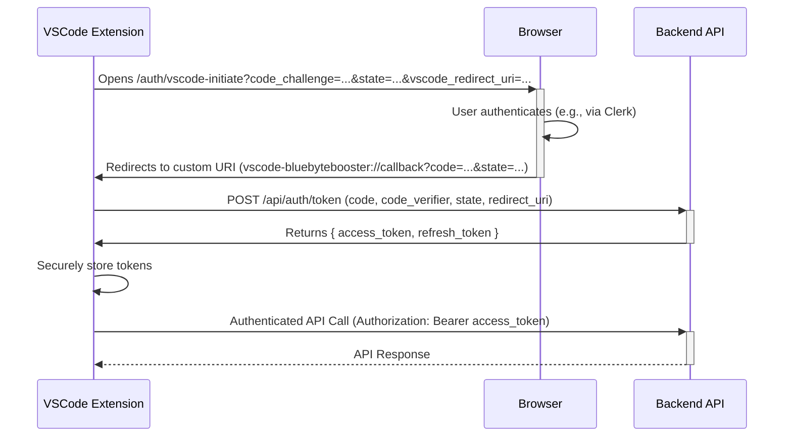

# Softcodes.ai: VSCode Extension Authentication Implementation Plan

This document outlines the detailed steps required to implement a secure authentication flow for the Softcodes.ai VSCode extension, integrating with a web service for user authentication and authorization.

## Authentication Flow Overview

The authentication process utilizes the OAuth 2.0 Authorization Code Flow with PKCE (Proof Key for Code Exchange) to securely authenticate the VSCode extension user.



---

## Phase 1: VSCode Extension Setup

### 1. Register Custom URI Scheme in `package.json`

To handle the callback from the browser, the extension must register a custom URI scheme.

-   **Action:** Add a `uriSchemes` contribution to your extension's `package.json`.
-   **Example:**
    ```json
    "contributes": {
      "uriSchemes": [
        "vscode-bluebytebooster"
      ]
    }
    ```

### 2. Implement Command to Trigger Authentication

Define a command that users can trigger to start the authentication process.

-   **Action:** Add a command to `package.json` and implement its logic.
-   **Example (`package.json`):**
    ```json
    "commands": [
      {
        "command": "bluebytebooster.authenticate",
        "title": "Sign in to Softcodes.ai"
      }
    ]
    ```

---

## Phase 2: Initiate Authentication Flow

### 3. Generate and Store `code_verifier` and `state`

The extension must generate a cryptographically random string (`code_verifier`) and a `state` parameter for CSRF protection. The `code_verifier` is used to create a `code_challenge`.

-   **Action:**
    1.  Generate a `code_verifier`.
    2.  Derive a `code_challenge` from the `code_verifier` (SHA256, then Base64-URL-encoded).
    3.  Generate a random `state` string.
    4.  Securely store the `code_verifier` and `state` using VSCode's `SecretStorage` or `Memento` API.

### 4. Construct `redirect_uri` and Open Browser

The extension constructs the URL to the web authentication endpoint and opens it in the user's default browser.

-   **Action:**
    1.  Construct the `redirect_uri` for the custom URI scheme (e.g., `vscode-bluebytebooster://callback`).
    2.  Open the browser to `/auth/vscode-initiate` with `code_challenge`, `state`, and `vscode_redirect_uri` as query parameters.

---

## Phase 3: Handle URI Callback

### 5. Register URI Handler

In the extension's activation logic, a handler for the custom URI is registered.

-   **Action:** Use `vscode.window.registerUriHandler` in the `activate` function.

### 6. Parse URI and Validate State

The handler will receive the callback URI, from which it must extract the authorization code and state.

-   **Action:**
    1.  Parse the incoming URI to get the `authorization_code` and `state`.
    2.  Validate the received `state` against the securely stored `state` to prevent CSRF attacks.

---

## Phase 4: Token Exchange

### 7. Exchange Code for Tokens

The extension makes a backend request to exchange the `authorization_code` for access and refresh tokens.

-   **Action:**
  1.  Make a `POST` request to the backend's `/api/auth/token` endpoint.
  2.  Include `authorization_code`, the original `code_verifier` (retrieved from secure storage), `state`, and `redirect_uri` in the request body.
  3.  The backend verifies the code with Clerk, fetches user data using standardized `userOperations.getUserByClerkId` from `src/utils/supabase/database.ts` (ensures consistent server-side Supabase client with service role key and robust error handling for user lookup).
  4.  Backend generates and returns long-lived JWT `access_token` (4 months expiry) and `refresh_token`.
  5.  Extension parses the response.

---

## Phase 5: Secure Token Storage

### 8. Store Tokens Securely

The received tokens must be stored securely.

-   **Action:**
    1.  Use `context.secrets.store()` to save the `access_token` and `refresh_token`.
    2.  Optionally, store the token's expiry time in `context.globalState` for proactive refreshing.

---

## Phase 6: Authenticated API Calls

### 9. Use `access_token` for API Calls

For all subsequent API requests, the `access_token` must be included.

-   **Action:** Add an `Authorization: Bearer <access_token>` header to all API requests.

---

## Phase 7: Refresh Token Logic

### 10. Implement Refresh Token Flow

When an API call fails with a 401 Unauthorized status, the extension should attempt to refresh the `access_token`.

-   **Action:**
    1.  On a 401 response, retrieve the `refresh_token` from secure storage.
    2.  Make a `POST` request to `/api/auth/refresh-token` with the `refresh_token`.
    3.  If successful, update the securely stored `access_token` and `refresh_token`.
    4.  If unsuccessful, prompt the user to re-authenticate.